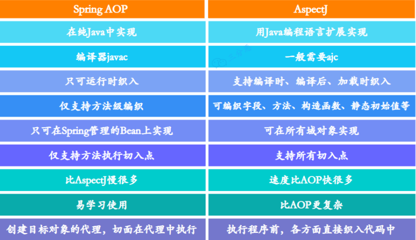
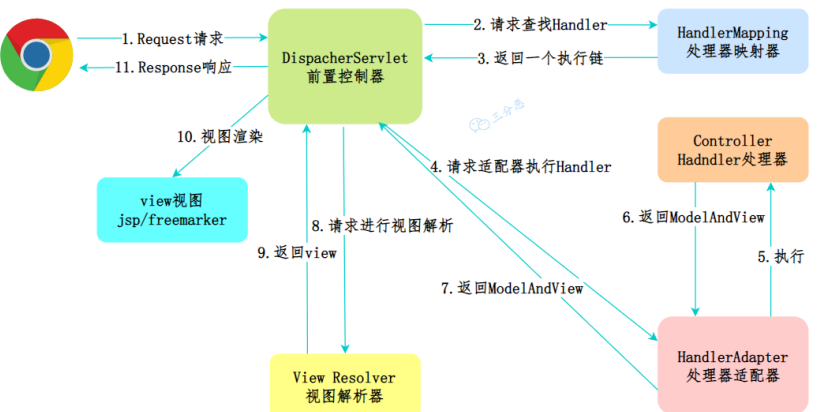
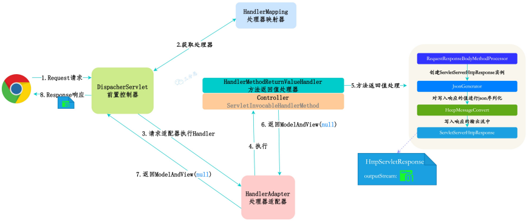
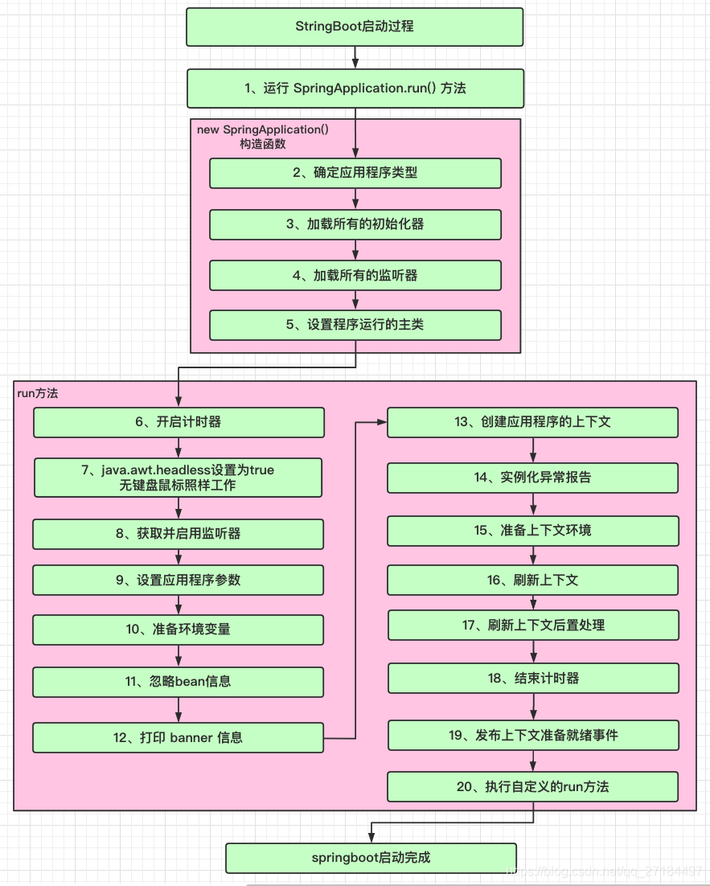

## Spring基础
Spring是一个轻量级、非侵入式的控制反转（IoC）和面向切面（AOP）的框架。

**Spring的特性**
- Ioc和DI支持
- AOP编程支持
- 声明式事务支持
- 快捷测试支持
- 快速集成支持
- 复杂API模板封装

**Spring的七大主要模块**
- Spring Core：Spring核心，提供控制反转和依赖注入特性；
- Spring Context：Spring上下文容器，提供对bean的配置、管理、依赖注入等功能；
- Spring Web：提供对Web应用的支持，包括Servlet、JSP、Struts、Spring MVC等；
- Spring MVC：提供MVC思想的实现；
- Spring DAO：提供JDBC抽象，简化DAO层的开发；
- Spring ORM：支持流行的ORM框架的整合；
- Spring AOP：面向切面编程，提供了与AOP联盟兼容的编程实现。

**Spring常用注解**

| 分类  | 注解              | 作用                           |
|-----|-----------------|------------------------------|
| Web | @Controller     | 标记用于处理Web请求的类                |
| Web | @RestController | @Controller和@ResponseBody的组合 |
| Web | @RequestMapping | 用于将请求路径映射到处理方法               |
| Web | @RequestBody    | 将请求参数转换成Java对象               |
| Web | @ResponseBody   | 直接将返回数据写入响应体中                |
| Web | @PathVariable   | 将URL的参数映射到方法参数               |
| 容器  | @Component      | 将类标记为容器中的组件                  |
| 容器  | @Service        | 将类标记为业务服务组件                  |
| 容器  | @Repository     | 将类标记为数据访问组件                  |
| 容器  | @Autowired      | 用于依赖注入                       |
| 容器  | @Qualifier      | 用于依赖注入时，指定具体实现类              |
| 容器  | @Value          | 用于从配置文件中注入值                  |
| 容器  | @Configuration  | 将类标记为配置类                     |
| 容器  | @Bean           | 将方法返回的对象标记为容器中的Bean          |
| 容器  | @Scope          | 定义Bean的作用范围                  |
| AOP | @Aspect         | 将类标记为切面类                     |
| AOP | @Pointcut       | 定义切点                         |
| AOP | @Before         | 前置通知，在被切的方法执行前执行             |
| AOP | @After          | 后置通知，在被切的方法执行后执行，比return更后   |
| AOP | @AfterRunning   | 返回通知，在被切的方法return后执行         |
| AOP | @AfterThrowing  | 异常通知，在被切的方法抛异常时执行            |
| AOP | @Around         | 环绕通知，在被切的方法执行前和后执行           |
| 事务  | @Transactional  | 用于声明式事务管理，标记类或方法为事务方法        |

**Spring主要使用的设计模式**：
- 工厂模式
- 单例模式
- 原型模式
- 代理模式
- 适配器模式
- 装饰器模式
- 观察者模式
- 模板方法模式
- 策略模式

---

## 控制反转（IoC）
控制反转（IoC）是由容器来控制对象的生命周期和对象间的关系。
依赖注入（DI）是控制反转的实现方式。

**SpringBean的生命周期**

- 实例化：通过构造器或工厂方法创建bean实例
- 属性赋值：通过setter方法或者构造器为bean的属性赋值
- 初始化：初始化bean实例，执行初始化方法
- 使用：bean实例被程序使用
- 销毁：销毁bean实例，执行销毁方法

**Bean定义和依赖定义方式**

- 直接编码方式
- 配置文件方式
- 注解方式

**依赖注入的方法**

- 构造器注入
- 属性注入
- 工厂方法注入

**自动装配**

Spring IoC容器知道所有Bean的配置信息，此外，通过Java反射机制还可以获知实现类的结构信息，如构造⽅法的结构、属性等信息。掌握所有Bean的这些信息后，Spring IoC容器就可以按照某种规则对容器中的Bean进⾏⾃动装配，⽽⽆须通过显式的⽅式进⾏依赖配置。

**自动装配的方式**

- byName：根据属性名进行自动装配
- byType：根据属性类型进行自动装配
- constructor：根据构造器进行自动装配
- autodetect：根据自省机制自动装配

**@Autowired注解自动装配的过程**

1. Spring容器启动会创建并维护所有的Bean的定义信息；
2. 当遇到@Autowired注解时，会在Bean初始阶段通过AutowiredAnnotationBeanPostProcessor处理自动装配逻辑；
3. 装配过程先解析注入点，获取目标类型；
4. 按类型装配，会查找与目标类型一致的所有Bean；
5. 如果指定@Qualifier，则进一步按照名称匹配；
6. 当查到多个Bean时，Spring会通过以下方式解决歧义性：
- 优先选择带@Primary注解的Bean；
- 选择与依赖名称匹配的Bean；
- 按照@Order顺序获取
7. 如果没有匹配到，则会抛出NoSuchBeanDefinitionException。

**Bean的作用域**

- singleton：单例，默认值，容器中只会有一个实例
- prototype：多例，每次获取bean都会创建一个新的实例
- request：每次HTTP请求都会创建一个新的实例
- session：每次HTTP会话都会创建一个新的实例
- globalSession：每次全局会话都会创建一个新的实例
- application：每次Web应用都会创建一个新的实例
- webSocket：每次WebSocket会话都会创建一个新的实例
- other：自定义作用域

**循环依赖**

循环依赖指在Bean初始化过程中，A依赖B，B依赖A，这样两个Bean就形成了循环依赖。

**循环依赖解决**

Spring通过三级缓存机制解决**单例Bean**循环依赖问题：
1. 在Bean创建过程中，Spring会先实例化对象，然后将其放入三级缓存中，此时对象还未完成属性注入和初始化；
2. 当发生循环依赖时，依赖方会从三级缓存中获取到目标Bean的ObjectFactory，通过getObject()方法获取到早期引用；
3. 三级缓存的结构包括：singletonObjects（存放创建成功的Bean）、earlySingletonObjects（存放创建中的Bean）和singletonFactories（存放ObjectFactory，用于获取早期引用）
4. 整个过程遵循“先暴露后完善”的原则，允许Bean在未完全初始化就被其它Bean引用。

**简易Ioc容器实现**

1. 定义容器接口，提供基本都Bean获取和管理功能；
2. 容器初始化时扫描指定路径下的类，并通过反射实例化类，并保存到容器中；
3. Bean的作用域管理，区分单例和原型；
4. 实现AOP功能，通过代理在Bean初始化前后写入逻辑。
整个过程中，工厂模式用于Bean创建，策略模式处理不同作用域，代理模式实现AOP。

**Spring、Spring MVC和Spring Boot的区别**

- Spring是整个生态的基础框架，提供IoC容器和AOP等核心功能；
- Spring MVC是基于Spring的Web框架，处理Http请求和响应，实现MVC模式；
- Spring Boot是Spring的扩展，通过自动配置和起步依赖简化Spring应用的初始搭建和开发过程。

**Spring启动几乎实例化所有Bean的原因**

- 尽早发现问题：能立即发现配置错误或依赖缺失问题；
- 保持一致性：避免运行时因Bean初始化顺序或线程安全问题导致的异常；
- 运行时性能更优：所有Bean都已初始化完成，不需要再处理依赖关系。

**Spring优化启动时间**

- 使用@Lazy注解标记可延迟加载的Bean；
- 合理设置Bean的作用域；
- 使用Spring Boot的懒加载陪吹吹
- 大型应用可以采用模块化加载

---

## 面向切面（AOP）
⾯向切⾯编程。简单说，就是把⼀些业务逻辑中的相同的代码抽取到⼀个独⽴的模块中，让业务逻辑更加清爽。

**AOP的理解**

AOP是面向切面编程，核心思想是将横切关注点（日志、事务、安全等）从业务逻辑分离出来。通过代理模式实现，在运行时动态地将代码切入到类的指定方法或位置。
核心概念包括：
- 切面（Aspect）：封装横切关注点的模块
- 连接点（JoinPoint）：程序执行过程中的特定点
- 切点（Pointcut）：匹配连接点的表达式
- 通知（Advice）：在连接点上执行的动作

**Spring AOP和AspectJ AOP的区别**

---

## 事务

**编程式事务**

编程式事务管理使⽤ TransactionTemplate，需要显式执⾏事务。

**声明式事务**

本质是通过AOP进行前后拦截实现，声明式事务管理使⽤@Transactional注解，只能在类或者方法上使用。

**Spring的事务隔离级别**

- READ_UNCOMMITTED：读未提交，允许脏读、不可重复读和幻读。
- READ_COMMITTED：读已提交，不允许脏读，但允许不可重复读和幻读。
- REPEATABLE_READ：可重复读，不允许脏读、不可重复读，但允许幻读。
- SERIALIZABLE：串行化，不允许脏读、不可重复读和幻读。
- READ_COMMITTED：默认使用数据库的隔离级别

**声明式事务的失效情况**

- 方法访问权限问题：在非public方法上使用导致失效；
- 自调用问题：同一个类中，方法A调用方法B（有事务），导致事务失效；
- 异常处理不当：默认只对运行时异常回滚，如果捕获了异常没有抛出，或检查型异常未配置rollbackFor，会导致事务是失效；
- 数据库引擎不支持
- 多数据源配置错误：没有正确配置事务管理器，或使用了错误的事务管理器；
- 传播行为不当
- 异步方法调用：@Async注解会导致事务失效；
- Bean未被Spring管理：比如直接new出来的对象，没有通过Spring容器获取；
- 事务超时：如果事务执行时间超过timeout设置，会自动回滚；

---

## MVC

**工作流程**

**SpringMVC Restful⻛格的接⼝流程**

---

## Spring Boot
Spring Boot 基于 Spring 开发，Spirng Boot 本身并不提供 Spring 框架的核⼼特性以及扩展功能，只是⽤于快速、敏捷地开发新⼀代基于 Spring 框架的应⽤程序。它并不是⽤来替代 Spring 的解决⽅案，⽽是和 Spring 框架紧密结合⽤于提升 Spring 开发者体验的⼯具。

**核心功能**

- 可独立运行的Spring项目：Spring Boot可以以jar包的形式独立运行。
- 内嵌的Servlet容器：Spring Boot可以选择内嵌Tomcat、Jetty或者Undertow，无须以war包形式部署项目。
- 简化的Maven配置：Spring提供推荐的基础 POM 文件来简化Maven 配置。
- 自动配置Spring：Spring Boot会根据项目依赖来自动配置Spring 框架，极大地减少项目要使用的配置。
- 提供生产就绪型功能：提供可以直接在生产环境中使用的功能，如性能指标、应用信息和应用健康检查。
- 无代码生成和xml配置：Spring Boot不生成代码。完全不需要任何xml配置即可实现Spring的所有配置。

**核心特性**

- 自动配置：Spring Boot会根据项目依赖来自动配置Spring 框架，极大地减少项目要使用的配置。
- 起步依赖：Spring Boot提供了一组依赖，通过这些依赖，开发者可以快速创建Spring Boot应用。
- 嵌入式容器：Spring Boot可以以jar包的形式独立运行，无需以war包形式部署项目。

**启动流程**

**微服务中实现session共享**

1. 基于Token的无状态：使用JWT等Token机制，将会话存储在客户端token中。服务端无需存储session，通过签名验证token有效性；
2. 集中式存储：将会话数据存储在Redis等分布式缓存中，服务节点通过共享Session id访问中央存储；
3. 会话复制：通过组播等方式在集群节点间同步session变化。

**在Spring Boot启动时执行特定代码**

- 实现CommandLineRunner接口；
- 实现ApplicationRunner接口；
- 使用@PostConstruct注解；
- 监听ApplicationReadyEvent事件；

**Spring Boot的启动依赖**

起步依赖是Spring Boot提供的一种特殊依赖描述符，它通过聚合相关技术的依赖来简化配置。主要体现在：
- 依赖管理简化：自动解决版本兼容问题；
- 开箱即用：提供合理的默认配置，开发者只需关注业务逻辑；
- 模块化设计：按功能划分的依赖包使项目结构更清晰；

**Spring Boot如何知道要创建哪个Bean**

- 组件扫描：通过@ComponentScan注解及其派生注解标记的所有类；
- 自动配置：@EnableAutoConfiguration会加载jar包中的所有自动配置类；
- 条件化创建：自动配置类中的@Bean方法；
- 配置属性绑定：通过@ConfigurationProperties将yml中的配置绑定到Bean属性上；

**Spring Boot的配置文件分类**

- 命令行参数：通过--key=value的形式设置，优先级最高；
- Java系统属性：System.getProperties()；
- 操作系统环境变量；
- 配置文件

**Spring Boot支持嵌入的Web容器**

- Tomcat：默认，性能稳定，适用大多数的应用场景；
- Jetty：快速启动和地内存占用；
- Undertow：需要Web Socket支持时，性能最高；

**Spring Boot处理跨域**

- 全局配置：通过WebMvcConfigurer接口实现
- 局部配置：使用@CrossOrigin注解
- 过滤器方式：通过自定义CorsFilter