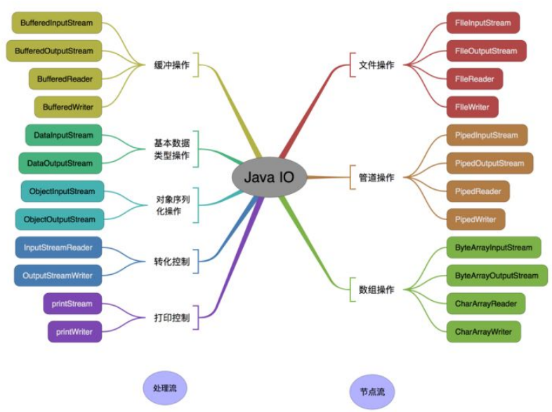
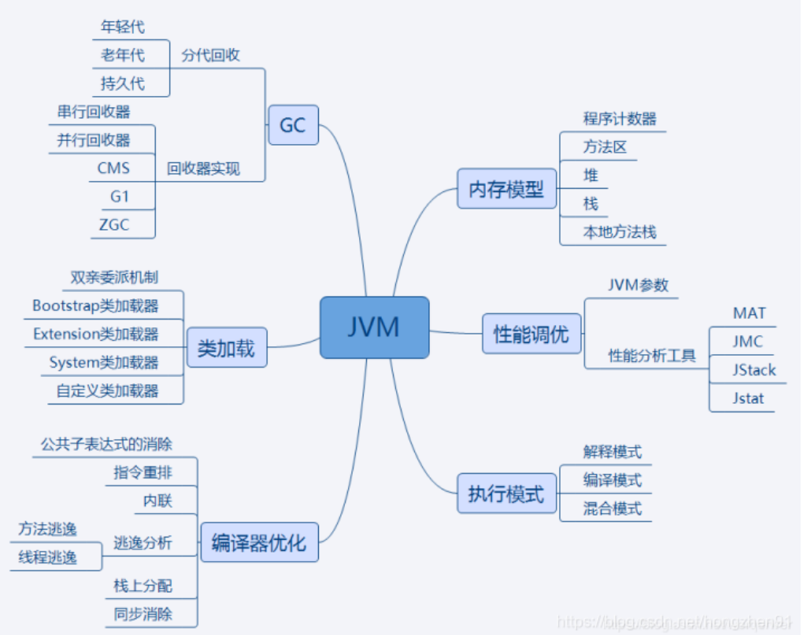
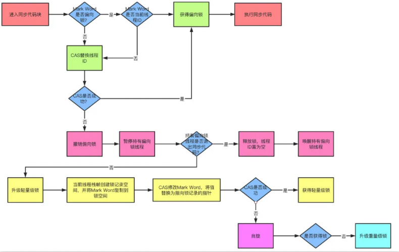
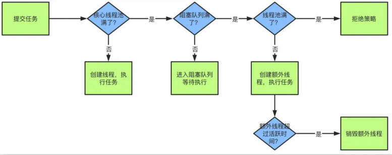

记录面试题的简单回答，便于记忆，实际可按理解扩充。
<!-- more -->

## 基础题

### 1.面向对象和面向过程的区别

面向过程：是分析解决问题的步骤，然后用函数一步步实现，性能高；\
面向对象：是把构成问题的要素拆分成对象，易维护、复用、拓展。

### 2.instanceof关键字段作用

判断一个对象是否为一个类的实例。

### 3.Java自动装箱和拆箱

装箱就是自动将基本数据类型转换为对应的包装类对象；\
拆箱就是自动将包装器类型转换为基本数据类型。

### 4.Hashcode的作用

该方法用于提高查找效率，通过哈希算法分成若干区域，存储元素时通过调用该方法根据哈希值迅速定位到对应到应存储的位置。

### 5.String、StringBuffer、StringBuilder的区别

String：只读字符串，每次使用都会创建一个新对象；\
StringBuffer: 可变字符串，线程安全，效率低；\
StringBuilder: 可变字符串，线程不安全，效率高.

### 6.ArrayList和LinkList的区别

ArrayList：底层是数组，查改效率高，增删效率低；\
LinkList：底层是链表，查改效率低，增删效率高。

### 7.HashMap和HashTable的区别

HashMap：父类为AbstractMap类，key和value可以为空，线程不安全，效率高；\
HashTable：父类为Dictionary类，key和value不能为空，线程安全，效率低。

### 8.Java的四种引用（强软弱虚）

强引用：默认的引用，只要垃圾回收器不进行回收，该对象就不会被回收；\
软引用：内存不足时，会被回收；\
弱引用：JVM垃圾回收器发现了，会被回收；\
虚引用：JVM垃圾回收器发现了，会被回收，但回收前会进入引用队列，可以监听到被回收。

### 9.泛型的特点

在定义类、接口、方法时，添加类型参数，在编译时确定类型。

### 10.Java创建对象的几种方式

new关键字；反射；克隆；序列化。

### 11.浅拷贝和深拷贝的区别

浅拷贝：不复制引用的对象；\
深拷贝：引用的对象也复制。

### 12.final的用法

final修饰类：不能被继承；\
final修饰方法：不能被重写；\
final修饰变量：又称常量，编译会存入常量池，引用不能被修改，但引用的值可变。

### 13.static的用法

修饰方法和变量：转换为静态方法和变量，不用new对象就可以调用;\
修饰代码块：在类加载时执行，只执行一次；\
修饰导入：可直接访问该包下的静态资源。

### 14.a=a+b与a+=b的区别

+=会进行隐式自动类型转换，a=a+b不会。

### 15.Exception和Error的区别

Exception：分为运行时异常和被检查异常，可以捕获；\
Error：编译器不会检查，不能捕获。

### 16.OOM和SOF的区别

OOM：Jvm堆溢出；JVM的栈扩展超出资源容量；常量池溢出；方法区溢出；\
SOF：栈溢出，一般默认为1-2m，一般是死循环和深度递归导致。

### 17.程序、进程、线程的关系

程序：程序包含程序代码和数据，是可执行文件；\
进程：进程是程序的一次执行过程，是资源分配的最小单位；\
线程：也称轻量级进程，是进程内多个执行流的执行单元，线程之间可相互影响。

### 18.Java序列或中某些字段不参与序列化

使用transient关键字修饰，只能修饰变量。

### 19.IO流

按流向分为输入流和输出流，按操作单元分为字节流和字符流，按角色分为节点流和处理流。

### 20.Java的反射

通过类名，可知该类的所有属性和方法，并动态调用；
可以通过Class.forName()、getClass()、.Class来获取Class对象。

### 21.List、Set、Map的区别

List：有序，可重复；
Set：无序，不可重复；
Map：无序，键值对，键不可重复。

### 22.fail-fast事件

多个线程同时操作同一个集合时，如果其中一个线程修改了集合，就会抛出ConcurrentModificationException异常，产生fail-fast事件，需使用java.util.concurrent包下的集合类。

### 23.HashMap的长度为什么是2的N次方

需要减少hash值的碰撞，保证数据均匀分配，2的N次方将%操作转换成&操作，提高运算效率。

## JVM

### 1.JVM内存模型

线程独占： 栈、本地方法栈、程序计数器；\
线程共享： 堆、方法区；

### 2.类的生命周期

加载字节码文件，验证文件要求，分配内存，解析引用，初始化静态内容，实际使用，GC卸载回收

### 3.双亲委派模式

加载器加载类时，先将请求委托给父类加载器，如果父类不能加载，再自己加载。

### 4.堆和栈的区别

堆：存放对象，线程共享，存储空间大；\
栈：存放局部变量和方法调用，线程私有，存储空间小。

### 5.判断对象是否可被回收

引用计数为0，可达性分析。

### 6.垃圾回收算法

标记清除：标记为0的清除，标记为1的不清除；\
标记整理：标记为1的保留，标记为0的清除，并调整内存地址。\
复制算法：将内存分为两块，每次只使用一块，当一块内存满时，将另一块内存复制到第一块，再使用第一块。\
标记压缩：标记为1的保留，标记为0的清除，并调整内存地址，减少内存碎片。\
分代收集算法：分为新生代和老年代，每次只回收其中一块，当一块内存满时，将另一块内存复制到第一块，再使用第一块。

### 7.JVM调优参数

-Xms：初始堆大小；\
-Xmx：最大堆大小；\
-XX:NewSize：新生代大小；
-XX:MaxNewSize：最大新生代大小；\
-XX:SurvivorRatio：Eden区与Survivor区的比例；\
-XX:+UserParallelGC：使用并行垃圾回收算法（年轻代）；\
-XX:+UseConcMarkSweepGC：使用并发标记清除算法（年老代）; \
...

## 多线程

### 1.实现多线程的方法

1.继承Thread类；\
2.实现Runnable接口；\
3.实现Callable接口；\
4.使用线程池。

### 2.如何停止正在运行的线程

1.使用退出标志；\
2.使用stop方法；\
3.使用interrupt方法。

### 3.notify()和notifyAll()的区别

1.notify()：随机唤醒一个等待线程，可能导致死锁；\
2.notifyAll()：唤醒所有等待线程。

### 4.sleep()和wait()的区别

1.sleep()：属于Thread类，线程休眠，不会释放锁；\
2.wait()：属于Object类，线程等待，会释放锁。

### 5.volatile的作用

1.保证不同线程对同一变量操作的可见性；\
2.禁止指令重排序；\
3.一般用于状态标记量和单例模式的双检锁。

### 6.Thread类中的start()和run()的区别

start()方法会创建一个新线程，并调用该线程的run()方法；\
run()方法只是调用线程的run()方法，不会创建新线程。

### 7.为什么wait和notify方法必须在同步代码块中执行

1.只有在调用线程拥有某个对象的独占锁时，才能调用wait()和notify()方法；\
2.如果不在同步代码块中执行，则调用wait()和notify()方法会抛出IllegalMonitorStateException异常; \
3.避免wait和notify方法在多线程间发生竞争，导致死锁。

### 8.Java中的synchronized和Reentrantlock的区别

1.synchronized：是Java内置的关键字，属于关键字同步，属于JVM层，属于轻量级同步；\
2.Reentrantlock：是java.util.concurrent包下的类，属于锁对象，属于用户层，属于重量级同步。

### 9.SynchronizedMap和ConcurrentHashMap的区别

1.SynchronizedMap：是java.util包下的类，是线程安全的Map，是同步的；\
2.ConcurrentHashMap：是java.util.concurrent包下的类，是线程安全的Map，是并发的。

### 10.Java线程池中submit()和execute()的区别

1.submit()：返回Future对象，可以获取线程执行结果；\
2.execute()：直接执行线程，不能获取线程执行结果。

### 11.synchronized关键字的了解

synchronized关键字是Java语言提供的一种同步机制，用于保证多个线程对共享资源的互斥访问。被synchronized修饰的方法、变量和代码块，同一时刻只能有一个线程执行。

### 12.常用的线程池

1.Executors.newCachedThreadPool()：创建一个可缓存线程池，如果线程池长度超过处理需要，可灵活回收空闲线程，若无可回收，则新建线程。\
2.Executors.newFixedThreadPool()：创建一个定长线程池，可控制线程最大并发数，超出的线程会在队列中等待。\
3.Executors.newScheduledThreadPool()：创建一个大小无限线程池，支持定时及周期性任务执行。\
4.Executors.newSingleThreadExecutor()：创建一个单线程化的线程池，它只会用唯一的工作线程来执行任务，保证所有任务按照指定顺序(FIFO, LIFO, 优先级)执行。

### 13.简述线程池的理解

1.降低资源消耗：通过重复利用已创建的线程降低线程创建和销毁造成的消耗。
2.提高响应速度：当任务到达时，任务可以不需要等到线程创建就能立即执行。
3.提高线程的可管理性：线程是稀缺资源，如果无限制创建，不仅会消耗系统资源，还会降低系统稳定性，使用线程池可以进行统一的分配，调优和监控。

### 14.锁的优化机制

锁的状态从低到高依次为无锁 > 偏向锁 > 轻量级锁 > 重量级锁，升级的过程就是从低到高，降级在一定条件也可能发生。\
自旋锁：让线程执行一个忙循环，防止从用户态转入内核态，默认次数是10次，可以使用-XX:+UseSpining来开启；\
自适应锁：就是自适应的自旋锁，自旋时间不固定，而是由前一次在同一个锁上的自旋时间和锁的持有者状态来决定；\
锁消除：指导是JVM检测到一些同步的代码块，完全不存在数据竞争的场景，就会进行锁消除；\
锁粗化：锁粗化指导是有很多操作都是对同一个对象进行加锁，就会把锁的同步范围扩展到整个操作序列之外；\
偏向锁：当线程访问同步块获取锁时，会在对象头和栈帧中的锁记录里存储偏向锁的线程ID，之后这个线程再次进入同步块都不需要CAS来加锁和解锁；\
轻量级锁：JVM的对象的对象头中包含一些锁的标志位，代码进入同步块的时候，JVM将会使用CAS方式来尝试获取锁，如果更新成功则会把对象头中的状态位标记为轻量级锁，如果更新失败，当前线程就尝试自旋来获取锁；\

### 15.产生死锁的四个必要条件

1.互斥条件：一个资源每次只能被一个线程使用；
2.请求与保持条件：一个线程因请求资源而阻塞，对已获得的资源保持不放；
3.不剥夺条件：进程已经获得的资源，在未使用完之前，不能强行剥夺；
4.循环等待条件：若干线程之间形成一种头尾相接的循环等待资源关系；

### 16.线程池的核心线程数怎么设置

分为CPU密集型和IO密集型
CPU密集型：主要消耗的是CPU资源，可以将线程数设置为CPU核心数+1；
IO密集型：主要处理I/O交互，一般核心线程数=CPU核心数量*2。

### 17.线程安全需要保证几个基本特征

- 原子性：相关操作不会中途被其它线程干扰，一般通过同步机制实现。
- 可见性：是一个线程修改了某个共享变量，其状态能够立即被其它线程知晓，通常被解释为将线程本地状态反映到主内存上，volatile就是负责保证可见性的。
- 有序性：是保证线程内串行语义，避免指令重排等。

### 18.线程之间如何通信

共享内存和消息传递

### 19.线程池原理及核心参数

核心参数：最大线程数、核心线程数、活跃时间、阻塞队列、拒绝策略

