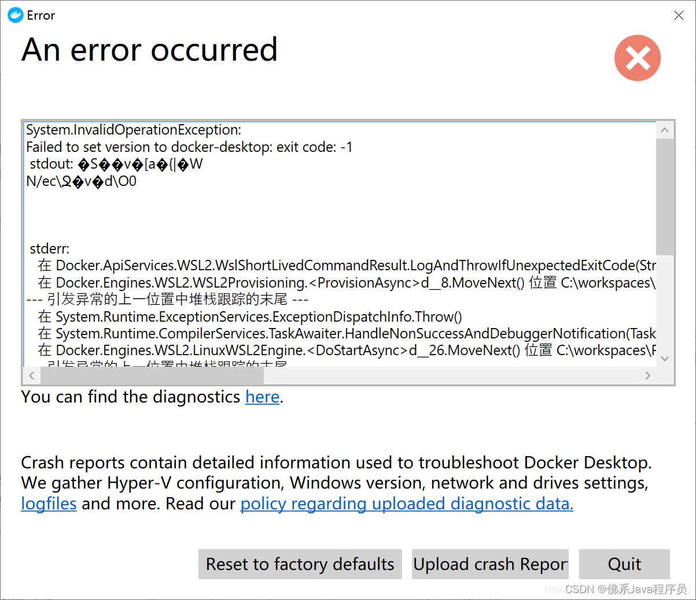
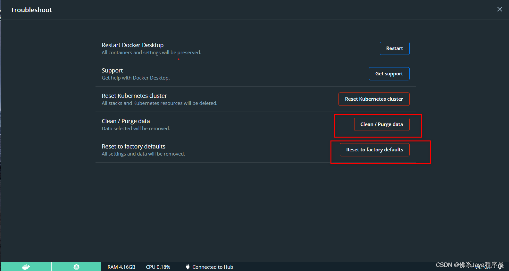

# 1.问题截图
（1）打开cmd，运行docker images报
```bash
error during connect: In the default daemon configuration on Windows, the docker client must be run with elevated privileges to connect.: Get "http://%2F%2F.%2Fpipe%2Fdocker_engine/v1.24/containers/json": open //./pipe/docker_engine: The system cannot find the file specified.
```
（2）运行Docker Desktop报错
```bash
System.InvalidOperationException: Failed to set version to docker-desktop: exit code: -1
```


# 2.解决方案


 - （1）以管理员身份运行cmd,先运行cd C:\Program Files\Docker\Docker（docker
   安装目录），再运行DockerCli.exe -SwitchDaemon（个人尝试没啥用）
 - （2）运行docker ps（个人尝试也没啥用）
 - （3）重启docker服务，将docker desktop恢复出厂设置（个人尝试还是没啥用）

 - （4）cmd运行 dism.exe /online /enable-feature
   /featurename:Microsoft-Windows-Subsystem-Linux /all
   /norestart,然后运行dism.exe /online /enable-feature
   /featurename:VirtualMachinePlatform /all
   /norestart，再将电脑重启（不知道哪看的，但个人尝试好像没啥用）
 - （5）cmd运行netsh winsock reset（终于解决了，但之前排雷太多导致自己的镜像全没了
 o(╥﹏╥)o）
