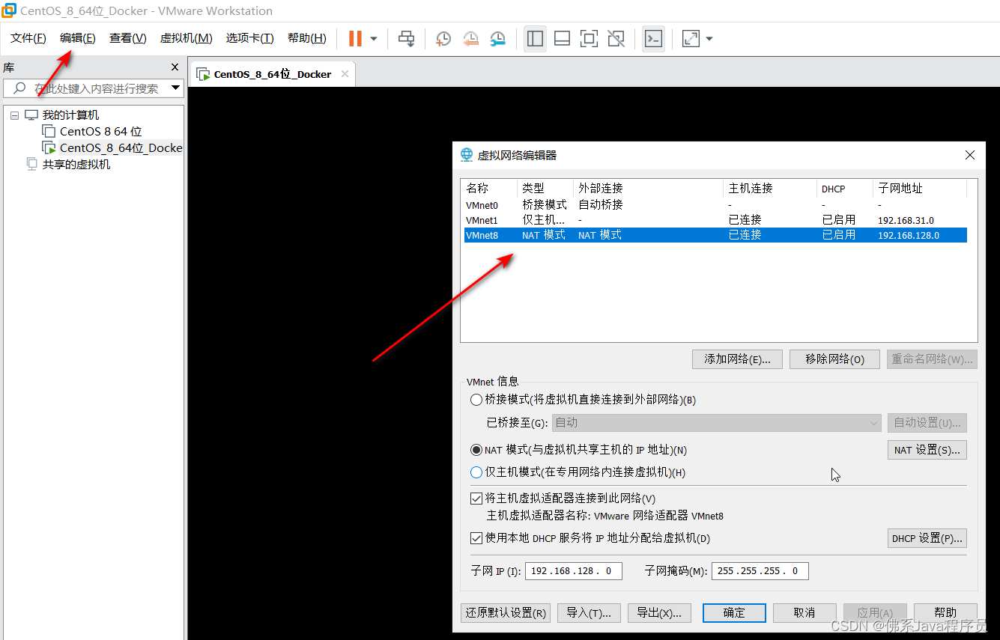
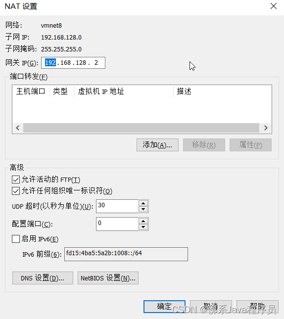
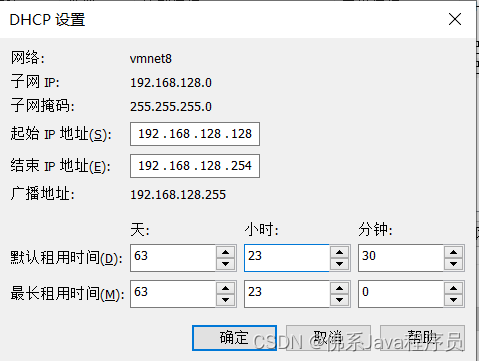
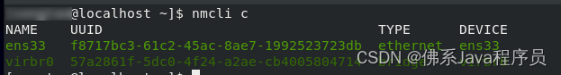
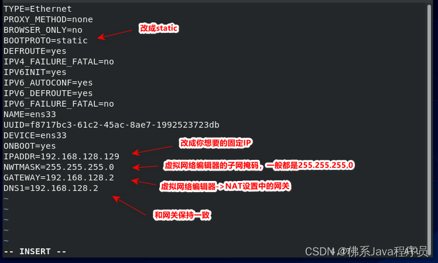
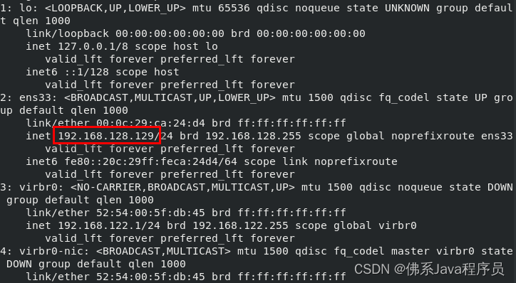

---
# 这是文章的标题
title: VM虚拟机配置化固定IP
date: 2024-12-10
category:
  - Vue
---

VM虚拟机配置化固定IP
<!-- more -->

## 1.设置虚拟网络

点击编辑 -> 虚拟网络编辑器进入虚拟网络编辑器，选择NAT模式，设置子网IP，注意子网IP为192.168.XXX.0, 则你的固定IP就需要为192.168.XXX.？,

点击NAT设置，配置你的网关信息。注意子网IP为192.168.XXX.0, 则你的网关也需要为192.168.XXX.？,

返回虚拟网络编辑器，点击DHCP设置，设置起始IP和结束IP, 注意设置的固定IP要在这个区间内。


## 2. 配置网卡信息
进入Linux系统，输入nmcli c显示对应的网卡信息；

有多个ens开头，个人看配置哪个，然后编辑对应的/etc/sysconfig/network-scripts/ifcfg-ens33文件（我这里是ens33, 就编辑的ifcfg-ens33文件），注意要拥有该文件的编辑权限，最好使用root账户
```bash
IPADDR=192.168.128.129
NWTMASK=255.255.255.0
GATEWAY=192.168.128.2
DNS1=192.168.128.2
```

最后，输入systemctl  restart  network重启网关，重启成功后，输入ip a查看对应的网卡是否有固定IP，有的话下次重启也是这个IP

