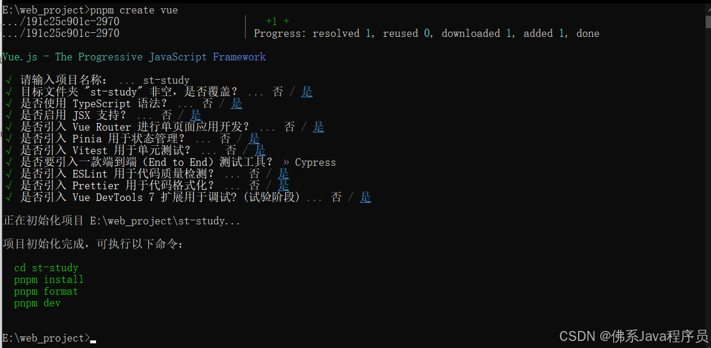
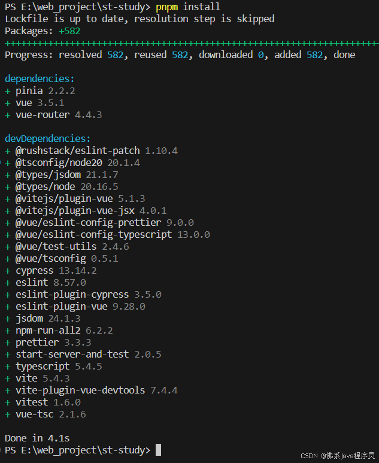
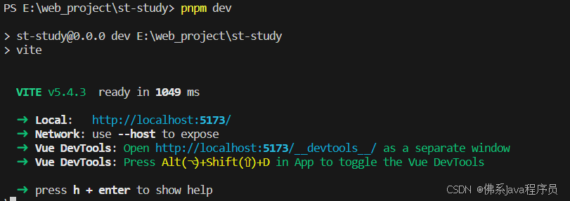
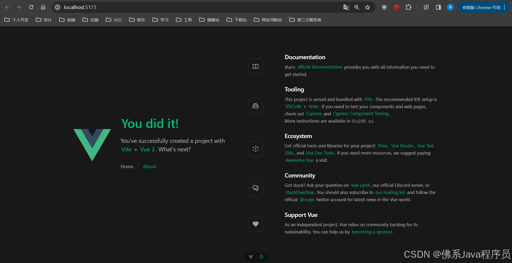

---
# 这是文章的标题
title: pnpm创建Vue3+Vite项目
# 设置作者
author: 宋涛
# 设置写作时间
date: 2024-09-05
# 一个页面可以有多个分类
category:
  - Vue
---
pnpm创建Vue3+Vite项目
<!-- more -->

## 初始化项目

（1）cmd切换到指定工作目录，运行`pnpm create vue`命令，输入项目名称后按需安装组件

（2）使用vs code打开所创建的项目目录，`Ctrl+~`快捷键打开终端，输入`pnpm install`下载项目所需组件

（3）终端运行`pnpm dev`启动项目，浏览器访问Local后的地址为项目页面



## 目录结构

```bash
│  .eslintrc.cjs ESLint配置文件
│  .gitignore Git忽略文件和目录
│  .prettierrc.json Prettier配置文件
│  cypress.config.ts Cypress配置文件
│  env.d.ts TypeScript声明文件
│  index.html 主页
│  package.json Node.js依赖管理文件
│  README.md MD文档说明文件
│  README_CN.md 中文MD文档说明文件
│  tsconfig.app.json TypeScript配置文件，定义项目中其他文件的ts编译规则
│  tsconfig.json TypeScript配置文件，引用tsconfig.app.json、tsconfig.node.json和tsconfig.vitest.json
│  tsconfig.node.json TypeScript配置文件，定义vite.config.ts文件的编译规则
│  tsconfig.vitest.json TypeScript配置文件，定义Vitest测试框架编译规则
│  vite.config.ts Vite配置文件，定义Vite构建框架的构建行为
│  vitest.config.ts Vitest配置文件，定义Vitest测试框架的环境和行为
├─.vscode vscode配置目录
│      extensions.json 插件配置
│      settings.json 用户配置
├─cypress Cypress自动化测试框架目录
│  ├─e2e 测试用例目录，用于存放测试用例
│  │      example.cy.ts 默认测试用例
│  │      tsconfig.json 配置端到端测试的TypeScript编译选项
│  ├─fixtures 数据目录，存储测试过程中需要的静态测试数据
│  │      example.json 默认示例数据
│  └─support 公共目录，存放测试中需要的工具函数、自定义命令以及可以共享的配置
│          commands.ts 存放全局自定义命令
│          e2e.ts 存放配置设置
├─node_modules 存放所需组件，pnmp install后出现
├─public 存放静态资源，不会经过webpack处理
│      favicon.ico Vue默认图标
└─src 项目核心代码目录
    │  App.vue 根组件，主入口文件
    │  main.ts 应用入口文件，定义全局配置
    ├─assets 静态资源目录，会经过webpack处理
    │      base.css 基础样式文件
    │      logo.svg 默认logo图标
    │      main.css 主要样式文件
    ├─components 组件目录，存放可复用组件
    │  │  HelloWorld.vue Vue默认的示例组件
    │  │  TheWelcome.vue Vue默认的欢迎组件
    │  │  WelcomeItem.vue TheWelcome的子组件
    │  ├─icons 图标组件目录
    │  │      IconCommunity.vue 社区图标组件
    │  │      IconDocumentation.vue 文档图标组件
    │  │      IconEcosystem.vue 生态系统图标组件
    │  │      IconSupport.vue 支持图标组件
    │  │      IconTooling.vue 工具箱图标组件
    │  └─__tests__ 存放与组件相关的测试文件
    │          HelloWorld.spec.ts HelloWorld组件的测试文件
    ├─router 存放路由相关的文件
    │      index.ts 路由配置核心文件，定义应用的路由规则、导航守卫和路由命名等
    ├─stores 存放Vuex状态管理相关的文件
    │      counter.ts 用于管理与计数器相关的状态和操作
    └─views 存放页面级别的组件
            AboutView.vue 关于页面内容组件
            HomeView.vue 主页内容组件
```