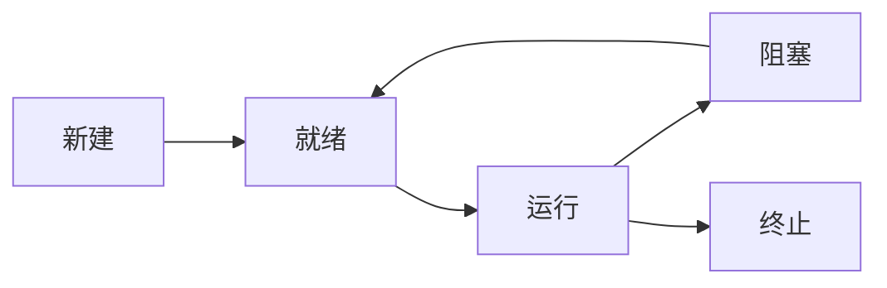

操作系统知识点
<!-- more -->

## 一、操作系统概述

### 1.1 基本概念
- **操作系统定义**：管理系统资源、控制程序执行、改善人机界面、提供各种服务的系统软件
- **四大基本功能**：
  - 进程管理
  - 内存管理
  - 文件管理
  - 设备管理

### 1.2 操作系统分类
| 类型 | 特点 | 典型代表 |
|------|------|---------|
|批处理系统|作业批量处理 | IBM OS/360|
|分时系统|时间片轮转 | Unix|
|实时系统|严格时间限制 | VxWorks|
|分布式系统|多机协同工作 | Google File System|

---

## 二、进程管理

### 2.1 进程状态转换


### 2.2 经典调度算法
| 算法名称 | 调度策略 | 优缺点 |
|---------|----------|--------|
|先来先服务(FCFS)|按到达顺序 | 产生饥饿现象 |
|时间片轮转(RR)|固定时间片 | 响应时间快 |
|优先级调度|优先级队列 | 可能出现优先级反转 |
|多级反馈队列|动态优先级调整 | 平衡响应和吞吐量 |

### 2.3 同步与互斥
- **临界区问题解决方法**：
  - 信号量（Semaphore）
  - 管程（Monitor）
  - 原子操作指令（TSL/XCHG）

- **典型问题**：
  - 生产者-消费者问题
  - 读者-写者问题
  - 哲学家进餐问题

---

## 三、内存管理

### 3.1 地址转换
- **逻辑地址→物理地址**转换过程：
  1. 计算页号与页内偏移
  2. 查页表获取物理块号
  3. 物理地址=块号×页大小+偏移

### 3.2 内存分配策略
| 方式 | 特点 | 碎片问题 |
|------|------|---------|
|连续分配| 固定分区/动态分区 | 外部碎片 |
|分页管理| 等分物理内存 | 内部碎片 |
|分段管理| 按逻辑单元划分 | 外部碎片 |
|段页式| 分段+分页结合 | 综合特性 |

### 3.3 页面置换算法
| 算法 | 策略 | Belady异常 |
|-----|------|------------|
|OPT | 置换未来最久不使用 | 无 |
|FIFO| 先进先出 | 存在 |
|LRU | 最近最久未使用 | 无 |
|CLOCK| 近似LRU | 无 |

---

## 四、文件系统

### 4.1 文件组织结构
- **常见结构**：
  - 顺序文件
  - 索引文件
  - 哈希文件
  - 倒排文件

### 4.2 磁盘调度算法
| 算法 | 扫描方式 | 特性 |
|-----|---------|-----|
|FCFS | 按请求顺序 | 公平但效率低 |
|SSTF | 最短寻道优先 | 可能饥饿 |
|SCAN | 电梯算法 | 双向扫描 |
|C-SCAN| 循环扫描 | 单向服务 |

---

## 五、设备管理

### 5.1 I/O控制方式
| 方式 | 特点 | CPU干预程度 |
|-----|------|------------|
|程序查询|轮询设备状态 | 100% |
|中断驱动|完成后触发中断 | 适中 |
|DMA | 直接内存存取 | 低 |
|通道控制|专用处理器控制 | 最低 |

---

## 六、安全与保护

### 6.1 安全威胁
- **常见攻击类型**：
  - 缓冲区溢出
  - 病毒/蠕虫
  - 权限提升
  - 拒绝服务（DoS）

### 6.2 访问控制模型
| 模型 | 原理 | 应用场景 |
|-----|------|---------|
|DAC|自主访问控制 | 个人文件管理 |
|MAC|强制访问控制 | 军事系统 |
|RBAC|基于角色控制 | 企业系统 |

---

## 附录：重点题型解题思路

### PV操作题分析步骤：
1. 确定资源类型及数量
2. 分析进程间的制约关系
3. 设置信号量初值
4. 编写PV操作序列

### 页面置换计算题：
```
给定访问序列：1,3,0,3,1,2,4,3,2,1
物理块数=3，求LRU算法缺页次数：
缺页次数=7次（详细计算过程略）
```

> 💡 **高频考点提示**：
> 1. 进程调度算法计算（周转时间/带权周转时间）
> 2. 银行家算法安全性检测
> 3. FAT文件系统链式存储计算
> 4. SCAN与C-SCAN算法磁道扫描顺序
