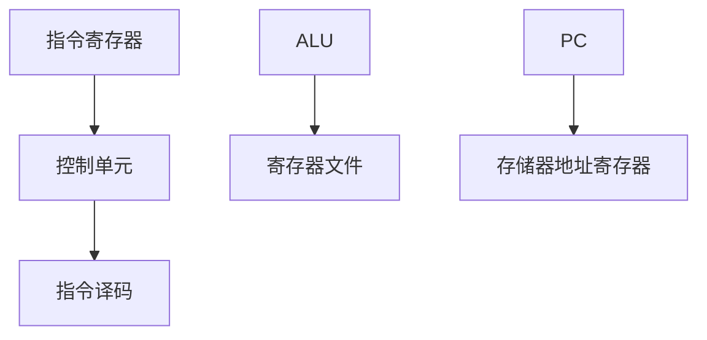
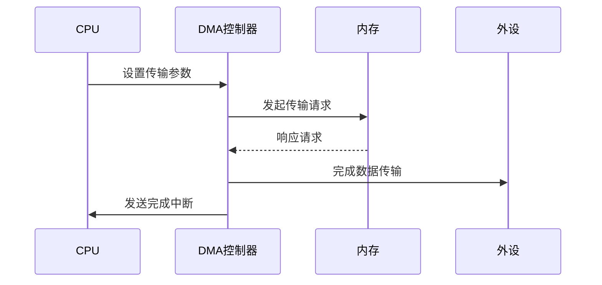

计算机系统结构
<!-- more -->

[选择题考点](计算机系统结构/选择题.md)
[填空题考点](计算机系统结构/填空题.md)

## 一、计算机系统概述

### 1.1 基本概念

- **冯·诺依曼体系**：五大组成部分（运算器、控制器、存储器、输入设备、输出设备）
- **性能指标**：
  - MIPS（每秒百万指令数）：
    $$\text{MIPS} = \frac{\text{主频}}{\text{CPI}} \times 10^6$$
  - CPI（每条指令周期数）
  - 程序执行时间公式：
    $$T = \frac{\text{指令数} \times \text{CPI}}{\text{主频}}$$

### 1.2 计算机分类
| 类型 | 特点 | 应用场景 |
|------|------|---------|
|SISD|单指令单数据流 | 传统CPU |
|SIMD|单指令多数据流 | GPU、向量机 |
|MIMD|多指令多数据流 | 多核处理器 |
|哈佛结构|指令存储分离 | 嵌入式系统 |

---

## 二、数据表示与运算

### 2.1 数值表示
- **补码范围**：
  $$-2^{n-1} \leq X \leq 2^{n-1}-1$$

- **IEEE754浮点格式**：
  ```mermaid
  graph LR
    单精度 --> 1位符号+8位阶码+23位尾数
    双精度 --> 1位符号+11位阶码+52位尾数
  ```

### 2.2 算术运算
- **布斯算法**（补码乘法）步骤：
  1. 初始化乘积寄存器
  2. 扫描乘数位判断加减操作
  3. 算术右移

---

## 三、指令系统

### 3.1 指令格式
| 类型 | 特点 | 示例 |
|------|------|-----|
|固定长度|便于流水线设计 | RISC |
|可变长度|节省存储空间 | x86 |
|扩展操作码|灵活编码 | MIPS |

### 3.2 寻址方式
| 类型 | 有效地址计算 | 应用场景 |
|------|-------------|----------|
|立即寻址|操作数=指令中的立即数 | 常数操作 |
|寄存器间接|操作数=(R) | 指针访问 |
|基址寻址|EA=(BR)+A | 数组访问 |
|相对寻址|EA=PC+A | 转移指令 |

---

## 四、中央处理器

### 4.1 CPU组成原理


### 4.2 流水线技术
- **五级经典流水**：
  1. 取指(IF)
  2. 译码(ID)
  3. 执行(EX)
  4. 访存(MEM)
  5. 写回(WB)

- **三类冒险处理**：
  | 类型 | 解决方法 |
  |------|---------|
  |结构冒险|增加资源/流水线停顿|
  |数据冒险|旁路技术/重排序|
  |控制冒险|分支预测/延迟槽|

---

## 五、存储系统

### 5.1 存储层次


### 5.2 缓存替换策略
| 算法 | 策略 | 实现难度 |
|-----|------|---------|
|LRU|最近最久未使用 | 高（硬件维护访问位）|
|FIFO|先进先出 | 简单（循环计数）|
|随机|随机选择 | 最低 |

---

## 六、输入输出系统

### 6.1 中断处理流程
1. 设备发送中断请求
2. CPU保存现场
3. 执行中断服务程序
4. 恢复现场返回

### 6.2 DMA传输过程


---

## 七、并行体系结构

### 7.1 多核处理器架构
- **UMA（均匀存储器访问）**：
  ```mermaid
  graph LR
    Core1 -->|同总线| Memory
    Core2 -->|同总线| Memory
  ```

- **NUMA（非均匀存储器访问）**：
  ```mermaid
  graph LR
    Node1[Core+Local Memory] --> Interconnect
    Node2[Core+Local Memory] --> Interconnect
  ```

### 7.2 多线程技术
| 类型 | 特点 | 实现方式 |
|------|------|---------|
|细粒度|指令级交替执行 | 硬件自动调度 |
|粗粒度|线程切换由软件触发 | 操作系统调度 |
|同步多线程(SMT)|同时执行多线程指令 | 超标量处理器 |

---

## 附录

### 重要公式速查表
| 名称 | 公式 |
|------|------|
|Amdahl定律| $$S = \frac{1}{(1-\alpha)+\alpha/k}$$ |
|Cache命中率| $$H = \frac{N_{hit}}{N_{total}}$$ |
|程序局部性原理|时间局部性 + 空间局部性 |

### 高频考点提示
1. 补码运算的溢出判断
2. 指令流水线时间计算
3. 缓存映射方式比较（直接、组相联、全相联）
4. 中断与DMA的异同分析
