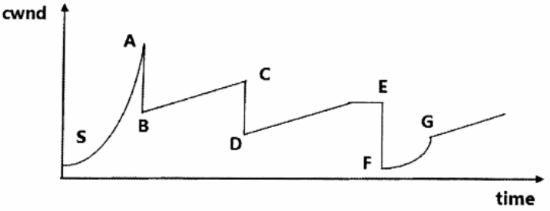
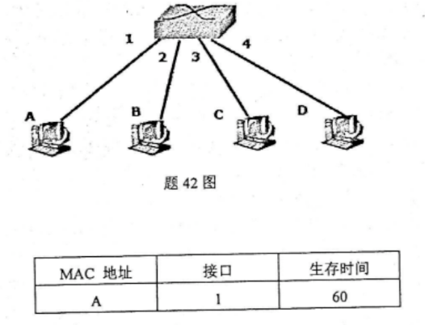

计算机网络原理综合题考点总结
<!-- more -->

### 1.题型一

设某网页的url为“http://www.abc.com html/index.html"且该urL对应的iP地址在你的计算机上没有缓存；文件index.html引用了8个小像。在域名解析的过程中，无等待的一次DNS解析请求与响应时间记为RTTd，HTTP请求传输web对象过程的一次往返时间记为RTTh。试给出:\
（1）该URL中的域名 \
（2）浏览器解析到该URL对应的IP地址的最短时间和最长时间 \
（3）若浏览器没有配置并行TCP连接，则基于HTTP1.0获取该Web页的完整内容（包括引用的图像）所需要的时间（不包括域名解析时间）\
（4）若浏览器配置5个并行TCP连接，则基于HTTP1.0获取该Web页的完整内容（包括引用的图像）需要的时间（不包括域名解析时间） \
（5）若浏览器没有配置并行TCP连接，则基于非流水方式的HTTP1.1获取该Web页完整内容需要的时间以及基于流水方式的HTTP1.1获取该Web页的完整内容（包括引用的图像）需要的时间（不包括域名解析时间）

**参考答案**
（1）www.abc.com
（2）4RTTd。最短时间即为一次无等待的DNS解析请求与响应为**RTTd**；最长时间则需要考虑DNS迭代解析最多经过4次查询（本地域名服务器、根域名服务器、顶级域名服务器、权威域名服务器）为**4TTTd**。
（3）HTTP/1.0不支持持久连接，每个对象需要单独建立TCP连接并发送HTTP请求，总共9个对象（HTML文件+8个图像），每次请求需要2次RTT（建立连接+传输数据），总时间为**9 × 2RTTh = 18RTTh**。
（4）若浏览器配置5个并行TCP连接，则可同时下载5个对象，则8个图像可分2轮完成，每轮的最大时间为2RTTh（建立连接+传输数据），此外，HTML文件需要花费2RTTh（建立连接+传输数据），因此总时间为**2 × 2RTTh + 2RTTh = 6RTTh**。
（5）若未配置并行TCP连接，且基于HTTP1.1获取Web页，则8个图像共享一个持久连接，但需要按序传输，每次传输需要1RTTh，共8RTTh，再加上HTML文件的建立连接（1RTTh）和数据传输（1RTTh），则总时间为 **1RTTh + 1RTTh + 8RTTh = 10RTTh**；若基于流水方式传输，则所有对象在一个RTT内通过管道化技术并发传输，8个图像传输仅需1RTTh，再加上HTML文件的建立连接（1RTTh）和数据传输（1RTTh），因此仅需**3RTTh**

### 2.题型二

设主机A和主机B由一条带宽为$R=10^8 bit/s$、长度为$D=100m$的链路互连，信号传播速率为$V=250000km/s$。如果主机A从t0时刻开始向主机B发送长度为$L=1024bit$的分组。试求: \
（1）主机A和主机B间的链路传输延迟$d_t$ \
（2）主机A发送该分组的传播延迟（时延）$d_p$ \
（3）该分组从主机A到主机B的延迟T:（忽略节点处理延迟和排队延迟） \
（4）在$t=d_t$时刻，分组的第一位在何处;（说明原因） \
（5）主机A与主机B间链路的时延带宽积G。

**参考答案**
（1）传输延迟$d_t = \frac {L(分组长度)}{R(链路带宽)} = \frac {1024 bit}{10^8 bit/s} = 0.01024ms = 10.24\mu s$
（2）传播延迟$d_p = \frac {D(链路长度)}{V(信号传播速度)} = \frac {100 m}{250000000 m/s} = 0.0004ms = 0.4\mu s$
（3）延迟$T = d_t + d_p = 10.24 \mu s + 0.4 \mu s = 10.64 \mu s$
（4）分组的第一位已到达主机B，因为$d_t > d_p$
（5）时延带宽积$G = d_p(传播延迟) × R(链路带宽) = 0.4 × 10^{-6} s × 10^8 bit/s = 40bit$

### 3.题型三

下图展示了TCP Reno拥塞控制算法中拥塞窗口的变化情况，请参照该示意图回答以下问题。\
 \
（1）图中SA、BC和FG分别是拥塞控制中的哪个阶段？\
（2）结点A、C、E、G处引起cwnd变化的原因分别是什么？\
（3）若图中A和C的高度是一样的，那么B和D两点的阈值有什么关系？\
（4）假设这个网络中只存在一个TCP连接，这个TCP连接的速度是否仍要不停地改变？

**参考答案**
（1）SA是慢启动阶段；BC是拥塞避免阶段；FG是慢启动阶段。
（2）A点原因：三个重复ACK表征的丢包；C点原因：三个重复ACK表征的丢包；E点原因：计时器超时表征的丢包；G点原因：拥塞窗口达到阈值，指数加速变成线性加速。
（3）相等。
（4）需要不停地改变。

### 4.题型四

已知IP地址172.32.1.113对应的子网掩码为255.255.254.0，求出：
（1）这个IP地址所在网络的网络地址；（写出计算过程）
（2）这个网段的IP地址范围；
（3）这个网段可分配的IP地址范围；
（4）这个网段的广播地址。

**参考答案**
（1）IP 地址与对应的子网掩码做逐位与运算，得到该IP地址所在网络的网络地址是 172.32.0.0
（2）这个网段的IP地址范围：172.32.0.0-172.32.1.255
（3）可分配的IP地址范围（去除子网地址和广播地址）：172.32.0.1-172.32.1.254
（4）这个网段的广播地址：172.32.1.255

### 5.题型五

假设某局域网由一台交换机和四台微机组成，连接情况如下图所示，当前的交换表如下表所示。现在A要发送数据到B，B在收到A的数据后对A进行回复。对照题下图，简要说明此过程中交换机和相应主机的工作过程及交换表的变化情况。

**参考答案**
(1)主机A将数据发送到交换机的1接口，交换机检测数据，发现目的MAC地址是B。
(2)交换机检索交换表，没有找到B接口的索引，开始泛洪。数据沿着交换机所有接口(1接口除外)发送出去。
(3)主机B收到了数据后对A进行回复，主机C、D丢弃收到的数据。
(4)交换机收到来自主机B的数据，把B的MAC地址和接口2的映射关系记录到交换表。
(5)交换机根据数据包中目的主机A的MAC地址检索交换表，发现A连接在它的1接口上，直接把数据沿1接口发出到主机A。

### 6.题型六

某局域网采用CSMA/CD协议实现介质访问控制，数据传输速率为1Mbit/s，主机A和主机B之间的距离为1km，信号传播速度为200000km/s，请回答: \
(1)假设主机A和主机B在发送数据的过程中，其他主机不发送数据。若主机A和主机B发送数据时发生冲突，则从开始发送数据时刻起，到两台主机均检测到冲突时刻止，所经过的最短和最长时间? \
(2)若网络不存在任何冲突与差错，主机A总是以标准的最长以太网数据帧向主机B发送数据，主机B每成功收到一个数据帧后立即向主机A发送一个64字节的确认帧，主机A收到确认帧后方可发送下一个数据帧。此时主机A的有效数据传输速率?并写出计算过程。
(说明:有效数据指以太网帧中封装的上层协议数据)

**参考答案**
(1)最短时间是主机A和主机B之间单向传播时延=1km/(200000km/s)=5μs;最长时间是2个单向传播时延，即10μs。\
(2)以太网最大帧长为1518B;
发送1518B的数据帧所用时间(传输时延)1518×8bit/=1Mbit/s=12.144ms;
发送64B的确认帧所用时间(传输时延)=64×8bit/1Mbit/s=0.512ms:
主机A从发送数据帧开始到收完确认帧为止的时间=12.144+0.512+2x0.005=12.666ms;
在12.666ms内发送的有效数据长度=1518B-18B=1500B=12000bit
主机A的有效数据传输速率=12000bit/12.666ms≈0.947Mbit/s