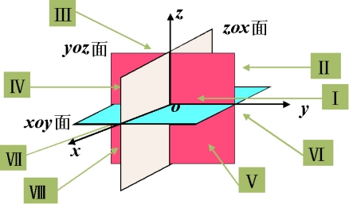

高等数学个人学习知识点记录。

<!-- more -->

## 1.函数

### 1.区间与邻域

设a，b为实数，且a < b，规定：

$a \leq x \leq b$ 区间表示为[a,b]，[]代表闭区间；

$a \lt x \lt b$ 区间表示为(a,b)，()代表开区间；

数轴表示：闭区间实心，开区间空心。

邻域：$U(a,\delta) = \{x|0<|x-a|<\delta\}=(a-\delta,a+\delta)$

### 2.函数基本定义

$$
y=f(x),x\in D
$$

其中，x为自变量，y为因变量，f为函数规则，D为函数的定义域。

**函数关系两要素**

1）定义域：自变量x的取值范围；

2）对应规则：给定x值，根据规则求y值，即x与y的依赖关系。

**函数定义域**

根号（开偶次方）：根号下的函数需$\geq 0$。

分子：函数为分母时，需$\neq 0$。

对数：真数需$>0$，底数需$> 0且 \neq 1$。

**分段函数**

绝对值函数，定义域$D=(-\infty, + \infty )$，值域$R = [0, \infty)$
$$
y=f(x)=|x|=
\begin{cases}
x & x \geq 0 \\
-x & x \lt 0
\end{cases}
$$
符号函数，定义域$D=(-\infty, + \infty )$，值域$R = \{-1,0,1\}$
$$
y=sgnx=
\begin{cases}
-1 & x < 0 \\
0 & x = 0 \\
1 & x > 0
\end{cases}
$$
**单调性**

单调递增：y随x的增大而增大。

单调递减：y随x的增大而减小。

注：函数的单调性必须指明对应的区间

```bash
判断函数的单调性常用方法：
1）根据定义判断：比较函数自变量为x1与x2的大小；
2）根据导数的符号判定
3）根据函数图像判定。
```

**奇偶性**
$$
\begin{cases}
f(-x) = -f(x)，则称函数f(x)为奇函数\\[2ex]
f(-x) = f(x)，则称函数f(x)为偶函数
\end{cases}
$$
注：

1）由定义可知，函数的奇偶性前提条件是定义域关于原点对称。

2）如果函数f(x)为奇函数，且在x=0点由定义，则f(0) = 0。

```bash
判断函数的奇偶性常用方法：
1）根据定义判断：定义域关于原点对称。
2）根据奇偶函数的运算性质判断：
    奇 + 奇 = 奇；    偶 + 偶 = 偶；    奇 + 偶 = 非奇非偶（函数为非零函数时）；
    奇 x 奇 = 偶；    偶 x 偶 = 偶；    奇 x 偶 = 奇。
3）根据函数图像判定。
```

**有界性**

函数$f(x)$在某区间$I$上有定义，如果存在常数$M>0$，使得对任意的$x \in I$，都有$|f(x) \leq M|$，则称$f(x)$在区间$I$上有界，否则称无界。

注：

1）函数的有界性要指明区间；

2）有界也可以表示为：存在常数$M_1,M_2$，对任意的$x \in I$，都有
$$
M_1 \leq f(x) \leq M_2
$$
**周期性**

从几何图形上看，周期函数的图像可以由一个周期内的图像左右平移得到，通常说函数的周期，指的是最小正周期。

注：

1）如果函数$f((x)$是以$T$为周期的周期函数，则$f(ax+b)$是以$\frac{T}{|a|}(a\neq0)$为周期的周期函数。

2）若1个函数由多个函数组成，则该函数的周期为多个函数周期的最小公倍数。

### 3.一次函数（直线）

$$
y=kx+b  (k\neq0)
$$

图像判断法：垂直x轴作直线，与图像只有1个交点

```bash
正比例函数要点：
1）恒过原点；
2）k的绝对值越大，斜率越陡；
3）当k>0时，单调递增；k<0时，单调递减；
4）适用于所有函数：上加下减（对于y），左加右减（对于x）；
5）适用于所有函数：函数的绝对值图像在y<0的部分，为原来y<0部分关于x轴对称的图形。
```

平行线：$k_1 =k_2$

垂直：$k_1k_2~=-1$

**求表达式**

1）过点(1,2)，k=3

点斜式：$y-y_0 = k(x-x_0)$ 结果为 $y-2=k(x-1)$

2）过点(1,2)，(3,5)

两点式：$\frac {y-y_1}{x-x_1} = \frac {y_2-y_1}{x_2-x_1}$ 结果为$\frac {y-2}{y-1} = \frac{5-2}{3-1}$

3）k=3，与y轴交点为(0,-2)

斜截式：$y=kx+b$ 结果为$y=3x-2$

### 4.二次函数（抛物线）

**一般式**
$$
y=ax^2+bx+c(a\neq0)​
$$

```
要点：
1）a>0，开口向上，a<0，开口向下；
2）|a|越大，开口越小（越陡），|a|越小，开口越大（越缓）；
```

**顶点式**
$$
y=a(x-m)^2+n​，其中(m,n)为顶点。
$$
**一般式转顶点式**
$$
y=a(x+\frac{b}{2a})+\frac{4ac-b^2}{4a}​
$$
顶点坐标：$(-\frac{b}{2a},\frac{4ac-b^2}{4a})$

求根公式：$x = \frac {-b \pm \sqrt {b^2 - 4ac}}{2a}$

要点：
1）a的意义：a>0，开口向上，a<0，开口向下

2）对称轴：x=$-\frac{b}{2a}$，a、b的符号相同，对称轴在左边，符号不同，对称轴在右边（左同右异）

3）与y轴交点：(0,c)

4）|a|的大小：|a|越大，开口越小（越陡），|a|越小，开口越大（越缓）

**求交点**

与x轴的交点：$b^2-4ac > 0$有2个交点，$b^2-4ac = 0$有1个交点，$b^2-4ac < 0$无交点

与y轴的交点：有且只有1个，为(0,c)

**交点式**

$$
y=a(x-x_1)(x-x_2)​
$$

1）抛物线与x轴两交点的横坐标1,3，过点(0,-3)

​    由公式可得：$y=a(x-1)(x-3)  $

​    代入点(0,3)得：$-3=a(0-1)(0-3) $

​    解得$a=-1 $

​    即$y=-1(x-1)(x-3) = -x^2+4x-3$

2）抛物线过点A(1,0)，B(3,0)，C(0,3)

​    由公式可得：$y=a(x-1)(x-3)  $

​    代入点(0,3)得：$-3=a(0-1)(0-3) $

​    解得$a=-1 $

​    即$y=-1(x-1)(x-3) = -x^2+4x-3 $

3）与x轴只有1个交点(3,0)，过(1,5)

​    由公式可得：$y=a(x-3)(x-3) =a(x-3)^2$

​    代入点(1,5)得：$5=a(1-3)(1-3) $

​    解得$a=\frac{5}{4}$

​    即$y=\frac{5}{4}(x-3)^2$

**绝对值**

函数绝对值：将y<0的图像作上下对称图形。

x绝对值：画出x>0的图像，则x<0的图像为x>0图像的对称图形。

### 5.反比例函数（双曲线）

$$
y=\frac{k}{x} (x\neq0)
$$

```
要点：
1）k>0，图像在一、三象限；x>0和x<0，均单调递减；
2）k<0，图像在二、四象限；x>0和x<0，均单调递增。
```

1）公式拓展：$y=\frac{k}{x} + b (x\neq0)$

图像依然适用于一次函数中的，上加下减，左加右减。

2）公式拓展：$y=|\frac{k}{x}+b| (x\neq0)$

y>0的图像不变，y<0的图像作上下对称图形。

### 6.三角函数

弧度：圆的周长除以半径
$$
\frac{2\pi r}{r} = 2 \pi = 360^{\circ}
$$
由此可得：

| $360^{\circ} = 2 \pi$           | $90^{\circ} = \frac {\pi}{2}$ | $30^{\circ} = \frac {\pi}{6}$ |
| ------------------------------- | ----------------------------- | ----------------------------- |
| $270^{\circ} = \frac {3\pi}{2}$ | $60^{\circ} = \frac {\pi}{3}$ |                               |
| $180^{\circ} = \pi$             | $45^{\circ} = \frac {\pi}{4}$ | $720^{\circ} = 4\pi$          |

根据度数求弧度：$度数 = \frac {度数}{180} \pi$

根据弧度求度数：$\frac{\pi}{90} = \frac{180}{90} = 2^{\circ}$

**正弦函数**
$$
y=sinx = \frac{对边}{斜边}
$$
$sin0^\circ=0$    $sin30^\circ = \frac{1}{2}$    $sin45^\circ = \frac{1}{\sqrt{2}}=\frac{\sqrt{2}}{2}$    $sin60^\circ = \frac{\sqrt{3}}{2}$    $sin90^\circ = 1$


定义域为R(全体实数)，值域为[-1,1]，周期为$2\pi$，奇偶性为奇函数（原点对称$sin(-x)=-sinx$）

**余弦函数**
$$
y=cosx = \frac{邻边}{斜边}
$$
$cos0^\circ=1$    $cos30^\circ=\frac{\sqrt{3}{}}{2}$    $cos45^\circ=\frac{\sqrt{2}}{2}$    $cos60^\circ=\frac{1}{2}$    $cos90^\circ=0$


定义域为R(全体实数)，值域为[-1,1]，周期为$2\pi$，奇偶性为偶函数（y轴对称$cos(-x)=cos(x)$）

**正切函数**
$$
y=tanx = \frac{sinx}{cosx} =\frac{对边}{邻边}
$$
$tan0^\circ=0$    $tan30^\circ=\frac{1}{\sqrt{3}}=\frac{\sqrt{3}{}}{3}$    $tan45^\circ=1$    $tan60^\circ=\sqrt{3}$    $tan 90^\circ=+\infty$


定义域为$x\neq k\pi+\frac{\pi}{2}$，值域为R，周期为$\pi$，奇偶性为奇函数（原点对称$tan(-x)=-tanx$）。

$$
sin\alpha^2 + cos\alpha^2 = 1
$$

**余切函数**
$$
cot\alpha = \frac{1}{tan\alpha} = \frac{cos\alpha}{sin\alpha}
$$


定义域为$x\neq k\pi$，值域为R，周期为$\pi$，奇偶性为奇函数（原点对称）。

常用弧度：

|      | $30^\circ$            | $45^\circ$            | $60^\circ$            |
|:----:|:---------------------:|:---------------------:|:---------------------:|
| sinx | $\frac{1}{2}$         | $\frac{\sqrt{2}}{2}$  | $\frac{\sqrt{3}}{2}$  |
| cosx | $\frac {\sqrt{3}}{2}$ | $\frac {\sqrt{2}}{2}$ | $\frac{1}{2}$         |
| tanx | $\frac {\sqrt{3}}{3}$ | 1                     | $\sqrt{3}$            |
| cotx | $\sqrt{3}$            | 1                     | $\frac {\sqrt{3}}{3}$ |

**正割函数**
$$
y=secx=\frac{1}{cosx}=\frac{斜边}{邻边}
$$


**余割函数**
$$
y=cscx=\frac{1}{sinx}=\frac{斜边}{对边}
$$


**图像性**

$y=c+asin(kx+b)$    $y=c+acos(kx+b)$    $y=c+atan(kx+b)$    $y=c+acot(kx+b)$

a：a>0，图像值域扩大a倍；a<0，图像翻转后扩大a倍。

b：b>0，图像向左移b位；b<0，图像向右移b位。

c：c>0，图像向上移c位；c<0，图像像下移c位。

k：图像周期变为$\frac {周期}{|k|}$，sin和cos的周期为$2\pi$，tan和cot的周期为$\pi$。

**诱导公式**

$sin(\pi + x) = -sinx$        $cos(\pi + x) = -cosx$        $tan(\pi + x) = tanx$

$sin(-x)=-sinx$        $cos(-x) = cosx$        $tan(-x)=-tanx$

$sin(\pi -x)=sinx$        $cos(\pi - x) = -cosx$        $tan(\pi - x) = -tanx$

$sin(\frac {\pi}{2} -x)=cosx$        $cos(\frac {\pi}{2} -x)=sinx$

$sin(\frac {\pi}{2} +x)=cosx$        $cos(\frac {\pi}{2} +x)=-sinx$

**三角恒等变换**

$sin(\alpha + \beta) = sin\alpha cos \beta + cos\alpha sin\beta \quad sin(\alpha - \beta) = sin\alpha cos \beta - cos\alpha sin\beta$

$cos(\alpha + \beta) = cos\alpha cos \beta - sin\alpha sin\beta \quad cos(\alpha-\beta) = cos\alpha cos \beta + sin\alpha sin\beta$

$tan(\alpha + \beta) = \frac {tan\alpha + tan\beta}{1 - tan\alpha tan\beta} \quad tan(\alpha - \beta) = \frac {tan\alpha - tan\beta}{1 + tan\alpha tan\beta}$

**对角公式**

$sin2\alpha = 2 sin\alpha cos\alpha$

$cos2\alpha = cos^2\alpha - sin^2\alpha = 1 - 2sin^2\alpha = 2cos^2\alpha -1$

$1-cosx = 2sin^2(\frac {x}{2})$

$tan2\alpha = \frac{2tan\alpha}{1 - tan^2\alpha}$

 $tanx - sinx = tanx(1 - cosx)$

**反三角函数**
$$
y=arcsinx，反函数为x=siny
$$
定义域为[-1,1]，值域为[-$\frac{\pi}{2}$,$\frac{\pi}{2}$]，单调递增，原点对称为奇函数。
$$
y=arccosx，反函数为x=cosy
$$
定义域为[-1,1]，值域为[0,$\pi $]，单调递减。
$$
y=arctanx，反函数为x=tany
$$
定义域为R，值域为[-$\frac{\pi}{2}$,$\frac{\pi}{2}$]，单调递增，原点对称为奇函数。
$$
y=arccotx，反函数为x=coty
$$
定义域为R，值域为(0,$\pi$)，单调递减。

### 7.幂函数

$$
y=x^a
$$

**注意：当0 < x < 1时，x越大，y越小；当 x > 1时，x越大，y越大。**

a > 1：a为偶数，则为抛物线；a为奇数，则关于原点对称；

0 < a < 1：a为偶数，x需大于0，单调递增，值域为$[0, + \infty]$；a为奇数，函数为奇函数，关于原点对称，$x \in R$，单调递增，值域为R；

a < 0：为反比例函数（参考3.反比例函数）。

### 8.指数函数

$$
y=a^x (a > 0 且 a \neq 1)
$$

0 < a < 1：$x \in R$，值域为$(0,+ \infty)$，恒过(0,1)点，单调递减；

a > 1：$x \in R$，值域为$ (0,+ \infty)$，恒过(0,1)点，单调递增。

**图像性**

处于一、二象限的曲线；

0 < a < 1：a越大，y为(0,1]的图像越陡，$[1, + \infty)$的图像越缓；

a > 1：a越大，y为(0,1]的图像越缓，$[1, + \infty)$的图像越陡。

### 9.对数函数

$$
y=log_ax(a > 0 且 a \neq 1) ，解读为a^y = x
$$

备注：$lg100 = log_{10} 100 = 2$     $ln e=log_e e =1$

**运算法则(M > 0, N > 0)**

$log_a(MN)=log_aM + log_aN$      $log_a \frac{M}{N} = log_aM - log_aN$

$log_aM^N = Nlog_aM$        $log_ab = \frac{log_cb}{log_ca}$        $log_{a^{-1}}x = -log_ax$

$e^{lna} = a$    $e^{-x} - 1 \Leftrightarrow 1-e^{x}$

0 < a < 1：定义域为$(0,+\infty )$，值域为R，恒过(1,0)点，单调递减；

a > 1：定义域为$(0,+\infty )$，值域为R，恒过(1,0)点，单调递增。

**图像性**

处于一、四象限的曲线；

0 < a < 1：a越大，x为(0,1]之间图像越陡，[1,+$\infty$)越缓；

a > 1：a越大，x为(0,1]之间图像越缓，[1,+$\infty$)越陡。

### 10.反函数

将原来的函数反解得到的函数，任给一个$y$，有唯一的$x$对应。
$$
x = f^{-1}(y),y \in R
$$
习惯上自变量用$x$表示，因变量用$y$表示，因此改写为
$$
y = f^{-1}(x),x \in R
$$
注：1）原函数的$x$与$y$是一对一关系，才有反函数；

2）函数$y=f(x)$与$y=f^{-1}(x)$互为反函数；

3）如果函数$f(x)$的定义域是$D_f$，值域为$R_f$，则反函数$y=f^{-1}(x)$的定义与为$R_f$，值域为$D_f$，即**反函数的定义域是原函数的值域，反函数的值域是原函数的定义域**。

### 11.复合函数

由多个函数的定义域与值域相交非空而组成的函数。

### 12.考点总结

一般考选择填空题

1）求函数基本定义域    2）判断函数是否相同    3）判断奇偶性

4）求周期    5）函数嵌套    6）根据函数定义域，求其它函数定义域

注      $a^3+b^3 = (a+b)(a^2-ab+b^2) \\ a^3-b^3 = (a-b)(a^2+ab+b^2) $

## 2.极限

### 1.数列极限

$$
lim_{n \to \infty} x_n = A或x_n \to A(n \to \infty)
$$

**性质**

1）唯一性：若数列${x_n}$收敛，则它的极限唯一；

2）有界性：若数列${x_n}$收敛，则数列${x_n}$是有界函数，该性质逆命题不成立，但逆否命题成立；

3）保号性

4）$\lim_{n \to \infty} x_n = A$，则对$\{x_n\}$的任何子数列${x_{k_n}}$，有$\lim_{k \to \infty} x_{n_k} = A$

注    1）如果数列$\{x_n\}$有一个子数列不收敛，或者有两个子数列极限存在但不相等，则$lim_{n \to \infty } x_n$不存在；

2）$\lim_{n \to \infty} x_n = A \Leftrightarrow \lim_{n \to \infty} x_{2n-1} = \lim_{n \to \infty} x_2n = A$


### 2.函数极限

$$
\lim_{x \to \infty} f(x) = A或f(x) \to A(x \to \infty)
$$

$\lim_{x \to \infty} f(x) = A$的充分必要条件是$\lim_{x \to -\infty} f(x)= \lim_{x \to +\infty} f(x)= A$；

**注** 函数的极限与函数的定义与值无任何关系。

**单侧极限**

左极限
$$
\lim_{x \to x_0^-} f(x) = A
$$
右极限
$$
\lim_{x \to x_0^+} f(x) = A
$$
$\lim_{x \to \infty} f(x) = A$的充分必要条件是$\lim_{x \to x_0^-} f(x)= \lim_{x \to x_0^+} f(x)= A$；

**性质**

1）唯一性：若极限$\lim_{x \to x_0} f(x)$存在，则极限值唯一；

2）局部有界性：若极限$\lim_{x \to x_0} f(x)$存在，则在点$x_0$的某个去心领域内，函数$f(x)$有界；

3）局部保号性：若极限$\lim_{x \to x_0} f(x) = A$，且$A > 0 或 $$A < 0$，则在点$x_0$的某个去心领域内，有$f(x) > 0$ 或 $f(x) < 0$。

### 3.无穷小

**无穷小**

极限为零的函数称为无穷小量，简称无穷小。

```
性质:
1）有限个无穷小的代数和仍是无穷小；
2）有限个无穷小的乘积仍是无穷小；
3）无穷小与有界函数的乘积仍是无穷小。
```

**无穷小的比较**

1）$\lim_{x \to \square} \frac {f(x)}{g(x)} = 0$，则称$f(x)$是比$g(x)$**高阶的无穷小**，记作$f(x) = o(g(x))$；

2）$\lim_{x \to \square} \frac {f(x)}{g(x)} = \infty$，则称$f(x)$是比$g(x)$**低阶的无穷小**；

3）$\lim_{x \to \square} \frac {f(x)}{g(x)} = c \neq 0$，则称$f(x)$与$g(x)$是**同阶无穷小**；

4）$\lim_{x \to \square} \frac {f(x)}{g(x)} = 1$，则称$f(x)$与$g(x)$是**等价无穷小**，记作$f(x) $~$g(x)$；

**等价无穷小替换**

$\frac 0 0$型使用：
$$
\lim_{x \to \square} \frac {f_1(x)}{g_1(x)} = \lim_{x \to \square} \frac {f_2(x)}{g_2(x)}
$$
注    1）在求两个无穷小之比的极限时，分子或分母都可用等价无穷小因子替换；

2）若分子或者分母为若干个因子的乘积，可以对其中的一个或几个无穷小因子作等价无穷小替换；

3）函数与函数加减不能用。


### 4.无穷大

$$
\lim_{x \to \square} f(x) = \infty
$$

1）两个（有限个）无穷大的乘积仍是无穷大；

2）无穷大与有界变量之和仍是无穷大。

**无穷大和无穷小之间的关系**

1）若$f(x)$为无穷大，则$\frac {1}{f(x)}$为无穷小；

2）若$f(x)(\neq 0)$为无穷小，则$\frac {1}{f(x)}$为无穷大。

### 5.极限四则运算

如果$\lim f(x) = A，\lim g(x) = B$，则

1）$\lim[f(x) \pm g(x)] = \lim f(x)  \pm \lim g(x) = A \pm B$

2）$\lim[f(x) g(x)] = \lim f(x)  * \lim g(x) = A  B$

3）$\lim \frac {f(x)} {g(x)} = \frac {\lim f(x)} {\lim g(x)} = \frac {A} {B}(B \neq 0)$

4）$\lim cf(x) = c \lim f(x) $（c为任意常数）

5）$\lim[f(x)]^n = [\lim f(x)]^n$，$\lim[f(x)]^{\frac 1 n} = [\lim f(x)]^{\frac 1 n}$（n为正整数）

**运算结论**

$x \to 0$：

只有函数乘除才可用


$x \to 常数$：

1）当函数为多项式函数或有理分式函数时，直接将趋向值代入函数即可；

2）若函数为有理分式函数，分母极限为0，分子极限不为0，则可直接断定该极限为无穷大；

3）对于$\frac 0 0$型的有理分式函数求极限，可先对分子、分母分解因式，约去无穷小因子，再求极限值；

4）若极限中含有无理式，且不容易求出极限，可先将分子、分母有理化，再求极限值。

$\lim_{x \to \infty} \frac {\infty}{\infty}$ ：


### 6.极限存在准则

**夹逼准则**

函数$f(x)，g(x)，h(x)$满足以下条件：

1）在点$x_0$的某个邻域内，有$g(x) \leq f(x) \leq h(x)$；

2）$\lim_{x \to x_0} g(x) = \lim_{x \to x_0} h(x) =A$

则$\lim_{x \to x_0} f(x) =A$

**单调有界准则**

单调有界数列必有极限。

### 7.重要极限

$$
\lim_{x \to 0}{\frac{sinx}{x}} =1 \quad \lim_{x \to 0}{\frac{x}{sinx}} =1
$$

$$
\lim_{x \to \infty}{(1+ \frac {1}{x})^x =e} \quad
\lim_{x \to 0}{(1+x)^{\frac 1 x} =e}
$$

### 8.考点总结

1）重要极限

2）等价无穷小替换

3）洛必达法则

4）无穷小 × 有界

5）抓大头

6）夹逼准则

## 3.连续

$$
\lim_{x \to x_0} f(x) = f(x_0)
$$

极限$f(x)$存在，$f(x)$在点$x_0$的邻域内有定义，极限$f(x)$与$f(x_0)$相等

### 1.间断点

如果函数$f(x)$有下列三中情形之一：

1）$f(x)$在点$x = x_0$处没有定义；

2）$f(x)$在点$x = x_0$处有定义，但$\lim_{x \to x_0} f(x)$不存在；

3）$f(x)$在点$x = x_0$处有定义，且$\lim_{x \to x_0} f(x)$存在，但$\lim_{x \to x_0} f(x) \neq f(x)$，

则函数$f(x)$在点$x_0$处不连续，即$f(x)$在点$x_0$处间断，称该点为函数的不连续点或间断点。

**间断点分类**

第一类间断点：左、右极限都存在（可去间断点、跳跃间断点）；

第二类间断点：左、右极限至少有一个不存在（震荡间断点、无穷间断点）。

### 2.初等函数的连续性

1）如果$f(x)、g(x）$在点$x_0$处都连续，则$f(x)$和$g(x)$的和、差、积、商（分母不为零）仍是连续函数；

2）如果$f(x)、g(x）$在点$x_0$处连续，则两个函数复合也是连续函数；

3）如果函数在某区间上连续且严格单调增加（减少），则其反函数在对应区间也是连续且严格单调增加（减少）。

### 3.闭区间连续函数的性质

1）有界性：若$f(x)$在闭区间[a, b]上连续，则$f(x)$在[a, b]上有界；

2）最值性：若$f(x)$在闭区间[a, b]上连续，则$f(x)$在[a, b]上必能取到最大值和最小值；

3）介值性

**零点定理**：若$f(x)$在闭区间[a, b]上连续，且$f(a)  × f(b) < 0$，则在$(a, b)$内至少存在一点$x_0$，使得$f(x_0) = 0$。

### 4.求函数间断点并判断其类型

判断间断点类型的步骤$(x=x_0是间断点)$：

第一步：求出左极限$\lim_{x \to x_0^-} f(x)$和右极限$\lim_{x \to x_0^+} f(x)$，

1）左右极限至少有一个不存在，则$x = x_0$是第二类间断点；

2）左右极限都存在，则$x = x_0$是第一类间断点，转下步，

第二步：判断$\lim_{x \to x_0^-} f(x)$和$\lim_{x \to x_0^+} f(x)$是否相等？

1）相等（$\lim_{x \to x_0} f(x)$存在），则$x =x_0$是可去间断点；

2）不相等，则$x = x_0$是跳跃间断点。

### 5.考点总结

1）间断点，一般分母为0

2）分段函数

3）零点定理，$f(a)  × f(b) < 0$

4）间断点类型：一类（极限存在，可去间断点（极限相等，极限值不等于函数值），跳跃间断点（左右极限不相等）），二类（极限不存在）

## 4.导数

### 1.定义

$$
f'(x_0) = \lim_{\Delta x \to 0} \frac {\Delta y}{\Delta x} = \lim_{\Delta x \to 0} \frac {f(x_0 + \Delta x) - f(x_0)}{\Delta x}
$$

也可表示为：
$$
f'(x_0) = \lim_{x \to x_0} \frac {f(x) - f(x_0)}{x -x_0}
$$
**单侧导数**

左导数：
$$
f_{-}'(x_0) = \lim_{\Delta x \to 0^-} \frac {f(x_0 + \Delta x) - f(x_0)}{\Delta x} = \lim_{x \to x_0^-} \frac {f(x) - f(x_0)}{x -x_0}
$$
右导数：
$$
f_{+}'(x_0) = \lim_{\Delta x \to 0^+} \frac {f(x_0 + \Delta x) - f(x_0)}{\Delta x} = \lim_{x \to x_0^+} \frac {f(x) - f(x_0)}{x -x_0}
$$
函数$f(x)$在点$x_0$处可导的充要条件是左导数和右导数都存在且相等。

**导数的几何含义**

导数$f'(x_0)$表示曲线$y=f(x)$在点$M(x_0, y_0)$处的切线斜率
$$
y-y_0 = f'(x_0)(x-x_0)
$$
过切点且与切线垂直的直线称为曲线的**法线**
$$
y-y_0 = - \frac {1}{f'(x_0)}(x-x_0) \quad (f'(x_0) \neq 0)
$$
**注** 连续是可导的必要条件，但不是充分条件。

### 2.求导法则

1）常数求导：$c' = 0$

2）幂函数的导数：$(x^a)'=ax^{a-1}$，常用的$(\frac {1}{x})' = -\frac {1}{x^2}，(\sqrt{x})' = \frac {1}{2\sqrt {x}}$

3）指数函数的导数：$(a^x)' = a^x\ln a,(a>0,a \neq 1) \quad$ $(e^x)' = e^x \quad$ $(e^{-x})' = -e^{-x} \quad$

4）对数函数的导数：$(log_ax)'= \frac {1}{x\ln a},(a>0,a\neq 1) \quad$$(\ln x)' = \frac{1}{x}$

5）三角函数的导数：

$(sinx)'=cosx \quad$ $(cosx)'=-sinx \quad$

$(tanx)'=sec^2x \quad$ $(cotx)'=-csc^2x \quad$

$(secx)'=tanx scex \quad$ $(cscx)'=-cotxcscx \quad$

6）反三角函数的导数：

$(arcsinx)' = \frac {1}{\sqrt {1-x^2}},(-1<x<1)$

$(arccosx)' = - \frac {1}{\sqrt {1-x^2}},(-1<x<1)$

$(arctanx)' = \frac {1} {1+x^2}$

$(arccotx)' = - \frac {1}{1+x^2}$

**加减乘除**

1）$[u\pm v]' = u' \pm v' $

2）$[uv]' = u'v +uv'$

3）$[\frac {u}{v}]' = \frac {u'v-uv'}{v^2}(v \neq 0)$

4）$[cu]'=cu'(c为常数) \quad$ $[\frac {c}{v}]'=-c \frac {v'}{v^2}(c为常数)$

5）$[\frac {1}{v}]' = - \frac{v'}{v^2}$

**反函数的求导法则**
$$
\varphi' (y) = \frac {1}{f'(x)}
$$
**复合函数的求导法则**

洋葱法则

**隐函数的求导法则**

1）公式法：先求函数对应的偏导数，再根据隐函数求偏导公式计算。

- 由方程\(F(x,y)=0\)确定\(y = y(x)\)的隐函数：

$$
\frac {dy}{dx}=-\frac {F_x}{F_y}
$$

其中$F_x=\frac{\partial F(x,y)}{\partial x}$表示$F(x,y)$对x的偏导数，$F_y=\frac{\partial F(x,y)}{\partial y}$表示$F(x,y)$对y的偏导数 。

- 由方程$F(x,y,z)=0$确定$z = z(x,y)$的隐函数：

$$
\frac{\partial z}{\partial x}=-\frac{F_x}{F_z}，\frac{\partial z}{\partial y}=-\frac{F_y}{F_z}
$$

其中$F_x=\frac{\partial F(x,y,z)}{\partial x}$，$F_y=\frac{\partial F(x,y,z)}{\partial y}$，$F_z=\frac{\partial F(x,y,z)}{\partial z}$分别表示$F(x,y,z)$对x、y、z的偏导数。

2）直接求导法：两边同时对x求导，隐函数最终求导可以包含y。

**对数的求导法则**

两边同时取$\ln$，再两边求导

**参数方程的求导法则**
$$
\frac {dy}{dx} = \frac {\frac {dy}{dt}}{\frac {dx}{dt}}
$$
**高阶导数的求导法则**

导数递归求导，一阶导数（$y'$），二阶导数（$y''$），三阶导数（$y'''$），四阶导数（$y^{(4)}$）...

### 3.微分

$$
dy = df(x) = A \Delta x
$$

**函数可微与可导的关系**
$$
dy = f'(x) \Delta x = f'(x)dx
$$
函数可微必可导，可导必可微。

### 4.考点总结

1）导数的定义

2）可导和连续

3）复合函数、隐函数、对数函数求导

5）切线和法线

6）高阶导数

## 5.导数的应用

### 1.罗尔中值定理

如果函数$f(x)$满足

1）在闭区间$[a,b]$上连续，

2）在开区间$(a,b)$内可导，

3）在区间两端点的函数值相等，即$f(a)=f(b)$。

那么，至少存在一点$\xi \in (a,b)$，使得$f'(\xi) = 0$。

### 2.拉格朗日中值定理

如果函数$f(x)$满足

1）在闭区间$[a,b]$上连续，

2）在开区间$(a,b)$内可导，

那么，至少存在一点$\xi \in (a,b)$，使得
$$
f'(\xi)=\frac {f(b)-f(a)}{b-a} \quad  或 \quad  f(b) - f(a) = f'(\xi)(b-a)
$$
**推论1** 若函数$f(x)$在区间$(a,b)$内可导，且$f'(x) \equiv 0$，则$f(x) \equiv c(c为常数)$。

**推论2** 若函数$f(x)与g(x)$在区间$(a,b)$内可导，且$f'(x) \equiv g'(x)$，则$f(x)=g(x)+c(c为常数)$。

### 3.柯西中值定理

如果函数$f(x)$满足

1）在闭区间$[a,b]$上连续，

2）在开区间$(a,b)$内可导，

且$g'(x) \neq 0$，那么，至少存在一点$\xi \in (a,b)$，使得
$$
\frac {f(b)-f(a)}{g(b)-g(a)}=\frac {f'(\xi)}{g'(\xi)}
$$
注 在柯西定理中，当$g(x)=x$时，即为拉格朗日中值定理。

### 4.洛必达法则

若函数$f(x),g(x)$满足

1）$\lim_{x \to x_0} f(x) = \lim_{x \to x_0}g(x) = 0$，

2）在点$x_0$的某去心邻域内可导，且有$g'(x) \neq 0$，

3）$lim_{x \to x_0} \frac {f'(x)}{g'(x)} = A(或\infty)$


### 5.单调性

 设函数$y=f(x)$在闭区间$[a,b]$上连续，在开区间$(a,b)$内可导，且$f'(x)$不变号，

1）若在$(a,b)$内$f'(x) > 0$，则函数$f(x)$在$[a,b]$上单调增加；

2）若在$(a,b)$内$f'(x) < 0$，则函数$f(x)$在$[a,b]$上单调减少。

**解题步骤**

1）确定函数$y=f(x)$的定义域；

2）求$f'(x)$，找出$f'(x)=0$的点(驻点)及$f'(x)$不存在的点；

3）以第二步中所找的点为分界点，将定义域分为若干个部分区间，在每个区间内讨论$f'(x)$的符号，确定函数的增减区间。

### 6.极值

设函数$f(x)$在点$x_0$的某邻域$(x_0 - \delta, x_0 + \delta)$内有定义，如果对任意的$\forall x \in (x_0 - \delta, x_0) \cup (x_0, x_0 + \delta)$，都有
$$
f(x) < f(x_0) \quad 或 \quad f(x) > f(x_0)
$$
则称$f(x_0)$为函数$f(x)$的极大值（或极小值），相应地点$x_0$称为函数$f(x)$的极大值点（或极小值点）。

​    函数的极大值和极小值统称为极值，极大值点和极小值点统称为极值点。

```
注：
1）函数的极值是局部性的概念（在邻域内比较大小）；
2）函数的极值可能不是唯一的，同一函数可以有多个极大值、多个极小值；
3）极大值未必大于极小值；
4）函数的极值不能在端点处取得。
```

**定理一**

极值存在的必要条件：如果函数$f(x)$在点$x_0$处取得极值，且$f’(x)$存在，则
$$
f'(x) = 0(驻点)
$$
注：

1）条件是必要的而不是充分的；可导的极值点是驻点，但是驻点未必是函数的极值点；

2）函数的极值点也可能是导数不存在的点；

3）$x_0$为极值点，可推出$f'(x) = 0 或 f'(x_0)不存在$，反之则无法推断。

**定理二**

极值存在的第一充分条件：设函数$f(x)$在点$x_0$的某个邻域内连续，在此邻域内可导($x_0$可除外)，当$x$由左至右通过$x_0$时，如果

1）当$x<x_0$时，$f'(x) > 0$；当$x>x_0$时，$f'(x) < 0$；则$f(x_0)$为函数$f(x)$的极大值；

2）当$x<x_0$时，$f'(x) < 0$；当$x>x_0$时，$f'(x) > 0$；则$f(x_0)$为函数$f(x)$的极小值；

3）若$f'(x)$在$x_0$的邻近两侧不改变符号，则$f(x)$在$x_0$处没有极值。

**定理三**

极值存在的第二充分条件：设函数$f(x)$在点$x_0$处具有二阶导数，且$f'(x_0) = 0$，那么

1）若$f''(x_0) > 0$，则$f(x_0)$为函数$f(x)$的极小值；

2）若$f''(x_0) < 0$，则$f(x_0)$为函数$f(x)$的极大值；

3）若$f''(x) = 0$，则$f(x_0)$是否为极值无法判断。


**海塞矩阵判别法**

​	设函数 $z = f(x,y)$ 在点$(x_0,y_0)$ 的某邻域内具有一阶和二阶连续偏导数，且$(x_0,y_0)$是 $f(x,y)$ 的驻点（即 $f_x(x_0,y_0)=0$ ，$f_y(x_0,y_0)=0$ ）。 令 $A = f_{xx}''(x_0,y_0)$，$B = f_{xy}''(x_0,y_0)$，$C = f_{yy}''(x_0,y_0)$，$\Delta=B^2 - AC$ ，则有：

- 当 $\Delta < 0$ 且 $A<0$ 时，函数 $f(x,y)$ 在点 $(x_0,y_0)$ 处取得极大值；
- 当 $\Delta < 0$ 且 $A > 0$ 时，函数 $f(x,y)$ 在点 $(x_0,y_0)$ 处取得极小值；
- 当 $\Delta> 0$ 时，函数 \(f(x,y)\) 在点 $(x_0,y_0)$ 处无极值；
- 当 $\Delta = 0$ 时，无法用此方法判定函数在点 $(x_0,y_0)$ 处是否有极值。

**解题步骤**

1）确定函数$f=f(x)$的定义域；

2）求$f'(x)$，找出$f'(x)=0$的点(驻点)及$f'(x)$不存在的点；

3）利用定理二或定理三逐一判断所找点是否极值点，并求出极大（小）值。

### 7.最值

设函数$f(x)$在区间$I$上有定义，$x \in I$，如果对任意的$\forall x \in I$都有
$$
f(x) \leq f(x_0) \quad 或 \quad f(x) \geq f(x_0)
$$
则称$f(x_0)$为函数$f(x)$在区间$I$上的最大值（或最小值），相应地点$x_0$称为函数$f(x)$的最大值点（或最小值点）

​    函数的最大值和最小值统称为最值，最大值点和最小值点统称为最值点。

```
注：
1）最值是全局性的概念（在整个区间I上比较大小）；
2）函数的最值如果存在，必是唯一的（最值点可能不唯一）；
3）最大值大于等于最小值；
4）函数的最值可以在端点处取得。
```

**解题步骤**

1）求$f'(x)$，求出$f'(x) = 0$的点(驻点)以及$f'(x)$不存在的点；

2）计算函数$f(x)$在驻点、f'(x)不存在的点和端点处的函数值；

3）比较这些函数值的大小，其中最大的值就是函数$f(x)$在区间$[a,b]$上的最大值，最小值同理。

注：

1）若函数$f(x)$区间$[a,b]$上单调，则在端点处取得最值；

2）若函数$f(x)$在开区间$(a,b)$只有一个极值点，则极值即为最值。

### 8.曲线的凸凹性

设函数$y=f(x)$在区间$I$上来连续，如果对任意的$x_1,x_2 \in I$，恒有
$$
f(\frac {x_1+x_2}{2}) < \frac {f(x_1)+f(x_2)}{2}
$$
则称函数$f(x)$在区间$I$上是凹的；若如果对任意的$x_1,x_2 \in I$，恒有
$$
f(\frac {x_1+x_2}{2}) > \frac {f(x_1)+f(x_2)}{2}
$$
则称函数$f(x)$在区间$I$上是凸的。

**定理一**

曲线凹凸性的判定定理：设$f(x)$在闭区间$[a,b]$上连续，在开区间$(a,b)$内有二阶导数，那么

1）若在$(a,b)$内，$f''(x) > 0$，则曲线$f(x)$在$[a,b]$上是凹的；

2）若在$(a,b)$内，$f''(x) < 0$，则曲线$f(x)$在$[a,b]$上是凸的。

注：

1）如果把定理结论中的闭区间换成其它区间，结论仍成立；

2）如果$f''(x) > 0(f''(x) < 0)$，而等号只在个别点成立，则不影响定理的结论。

**定理二**

拐点存在的必要条件：若点$(x_0,f(x_0))$为曲线$y=f(x)$的拐点，则
$$
f''(x_0)=0 \quad 或 \quad f''(x_0)不存在
$$
注：

1）函数曲线上凹凸两部分的分界点称为曲线的拐点；

2）$f''(x_0) = 0$或$f''(x_0)$不存在的点只是可能的拐点，是否是拐点，还需进一步判断；

3）拐点是曲线上的点，必须用$(x_0,f(x_0))$表示。

**解题步骤**

1）确定函数$y=f(x)$的定义域；

2）求$f'(x),f''(x)$，找出$f''(x)=0$的点(拐点)及$f''(x)$不存在的点；

3）以第二步中所找出的点为分界点，将定义域分割成若干部分区间，在每一区间内讨论$f''(x)$的符号，确定函数的凹凸区间，逐一判断分界点是否拐点。

### 9.渐近线

**水平渐近线**

设函数$y=f(x)$的定义域包含无穷区间，若
$$
\lim_{x \to x_0} f(x) = b \quad 或\lim_{x \to +\infty} f(x)=b \quad 或\lim_{x \to -\infty} f(x) =b
$$
则直线$y=b$为曲线$y=f(x)$的一条水平渐近线。

**铅直（垂直）渐近线**

设函数$y=f(x)$在点$x=c$间断，若
$$
\lim_{x \to c} f(x) = \infty \quad 或\lim_{x \to c^+} f(x)= \infty \quad 或\lim_{x \to c^-} f(x) =\infty
$$
则直线$x=c$为曲线$y=f(x)$的一条铅直（垂直）渐近线。

## 6.不定积分

### 1.定义

若$f(x)$在区间$I$上存在原函数，则称$f(x)$的原函数的全体为$f(x)$的不定积分，记作
$$
\int f(x)dx
$$
其中$\int$称为积分号，$f(x)$为被积函数，$x$为积分变量，$f(x)dx$为被积表达式；

​    由上可知，若$F(x)$为$f(x)$的一个原函数，则
$$
\int f(x)dx = F(x)+c \quad (c为常数)
$$
简单地说，不定积分就是一个函数$f(x)$的所有原函数的集合，求解过程就是求函数$f(x)$的原函数族。

**常用公式**

$\int 2xdx=x^2+c \quad$ $\int xdx=\frac {1}{2} x^2+c \quad$ $\int cosxdx=sinx+c \quad$

$\int e^xdx=e^x+c \quad$ $\int 2^x\ln2 dx=2^x+c \quad$ $\int \frac {1}{1+x^2}dx=arctanx+c \quad$

注：

1）求不定积分是求导数的逆运算；

2）求解不定积分实际上就是寻找一个原函数的过程。

### 2.性质

若$F(x)$为$f(x)$的一个原函数，则

**性质一**

（1）$[\int f(x)dx]'=f(x)$ 或 $d[\int f(x)dx] = f(x)dx$

（2）$\int F'(x)dx = F(x)+c$ 或 $\int dF(x) = F(x)+c$

**性质二**

$\int kf(x)dx = k \int f(x)dx$

**性质三**

$\int [f(x) \pm g(x)]dx = \int f(x)dx \pm \int g(x)dx$

### 3.基本公式

1）$\int kdx = kx +c \quad (k为常数)$，特别地$\int 0dx =c$

2）$\int x^\alpha dx = \frac {1}{\alpha+1} x^{\alpha+1}+c \quad (\alpha \neq 1)$

3）$\int \frac {1}{x} dx = ln|x|+c \quad (注意在x可正可负的情况下，需要加上绝对值号)$

4）$\int a^xdx = \frac {1}{\ln a} a^x+c \quad (当a=e时，\int e^xdx = e^x+c)$

5）$\int sinxdx = -cosx+c$

6）$\int cosxdx = sinx+c$

7）$\int \frac {1}{cos^2x}dx = tanx+c$

8）$\int \frac {1}{sin^2x}dx = -cotx+c$

9）$\int \frac {1}{\sqrt {1-x^2}} dx = arcsinx+c \quad (也可写成-arccosx+c)$

10）$\int \frac {1}{1+x^2}dx =arctanx+c \quad (也可写成-arccotx+c)$

**扩展公式**

11）$\int \frac {1}{\sqrt {a^2 - x^2}} dx = arcsin \frac {x}{a}+c \quad (a > 0)$

12）$\int \frac {1}{a^2 + x^2} dx = \frac {1}{a} arctan \frac {x}{a}+c \quad (a > 0)$

13）$\int tanxdx = - \ln |cosx|+c$

14）$\int cotxdx = \ln|sinx|+c$

15）$\int cscxdx = \ln|cscx-cotx|+c \quad 或\int \frac {1}{sinx}dx=\ln|\frac {1-cosx}{sinx}|+c$

16）$\int secxdx = \ln|secx+tanx|+c \quad 或 \int \frac {1}{cosx}dx = \ln|\frac {1+sinx}{cosx}| +c$

17）$\int \frac {1}{x^2-a^2}dx = \frac {1}{2a}\ln |\frac {x-a}{x+a}|+c (a \neq 0)$

18）$\int \frac {1}{\sqrt {x^2+a^2}}dx=\ln(x+\sqrt {x^2+a^2})+c$

19）$\int \frac {1}{\sqrt {x^2-a^2}}dx=\ln|x+\sqrt {x^2-a^2}|+c$

### 4.求解方法

**第一换元法（凑微分法）**

若$g(u)$在$[α,β]$上存在原函数$G(u)$，则$f(x)$在$[a,b]$上也存在原函数$F(x)$，且$F(x)=G(φ(x))+c$,即
$$
∫f(x)dx=∫g(φ(x))φ’(x)dx=∫g(u)du=G(u)+c=G(φ(x))+c
$$
**第二换元法**

设$x=\varphi(t)$为单调可导函数，且$\varphi'(t) \neq 0$，又$\int f[\varphi(t)]\varphi'(t)dt = F(t)+c$，则有
$$
\int f(x)dx = F(\varphi'(x))+c
$$
**分部积分法**
$$
\int udv = uv-\int vdu
$$
解题技巧：

1）谁拿到d的后面（$e^x > sinx,cosx > x^n >...>lnx$）

2）有时需分部多次

### 5.有理分式

有理分式：多项式除以多项式

真有理分式：分子次数小于分母次数

假有理分式：分子次数大于等于分母次数

**解题技巧**

## 7.定积分

### 1.定义


​    对于在实数区间$[a,b]$上诱定义的函数$f(x)$，并在$[a,b]$上给出满足$a=x_0<x_1<...<x_n=b$的区间族$T={[x_{i-1}]|1 \leq i \leq n}$作为其部分，令$||T||=\displaystyle \max_{1 \leq i \leq n}(x_i-x_{i-1})$为部分的最大直径。

​    取$\xi_i \in [x_{i-1},x_i]$，那么称函数$f$在区间$[a,b]$上的黎曼和为：
$$
l_T(f)=\sum_{i=1}^n f(\xi_i)(x_i - x_{i-1})
$$
​    当极限$\displaystyle \lim_{||T|| \to 0} I_T(f)$存在时，定积分有定义：
$$
\int_a^b f(x)dx = \lim_{||T|| \to 0} I_T(f)
$$
​    直观地看，定积分描述的是函数图像$y=f(x)$和直线$x=a,x=b$，$x$轴围成的曲边梯形的正向面积（即在$x$轴上方部分的面积被记为正，在$x$轴下方部分的面积被记为负）。

简单地说，定积分就是在有限区间内对函数进行积分，函数在该区间有界且可积。

### 2.性质

约定1：$\int_a^a f(x)dx = 0$，即若区间长度为0，则定积分也为0；

约定2：$\int_a^b f(x)dx=-\int_b^a f(x)dx$，即交换积分上下限后，改变符号。

性质1：$\int_a^b kf(x)dx = k\int_a^b f(x)dx$

性质2：$\int_a^b [f(x)+g(x)]dx = \int_a^b f(x)dx + \int_a^b g(x)dx$

性质3：$\int_a^b f(x)dx= \int_a^c f(x)dx + \int_c^b f(x)dx$

性质4：$\int_a^b 1dx = (b-a)$

性质5：若在$[a,b]$上，$f(x) \leq g(x)$，则$\int_a^b f(x)dx \leq \int_a^b g(x)dx$

性质6：若$m,M$分别为$f(x)$在$[a,b]$上的最小值和最大值，即在$[a,b]$上恒有$m \leq f(x) \leq M$，则有$m(b-a) \leq \int_a^b f(x)dx \leq M(b-a)$

性质7（积分中值定理）：若$f(x)$在$[a,b]$上连续，则存在$\xi \in [a,b]$，使得$\int_a^b f(x)dx =f(\xi)(b-a),\xi \in [a,b]$

### 3.变上限积分函数

考察定积分$\int_a^x f(t)dt$，随着$x$的变化而变化，当固定积分下限、被积函数后，该定积分就只随$x$的变化而变化，与$x$形成函数关系，称其为变上限积分函数，记作
$$
P(x)=\int_a^x f(t)dt
$$
**定理**：若$f(x)$在$[a,b]$上连续，则变上限积分函数$P(x)=\int_a^x f(t)dt$在$[a,b]$上可导，且有$P'(x)=f(x)$，即$P(x)$是$f(x)$的一个原函数。

**求积分**
1）下限为常数，上限为x，则直接将上限代入被积函数中；
2）下限为常数，上限为函数，则代入被积函数后仍需对复合函数求导；
3）下限为函数，上限为函数，则$[\int_{h(x)}^{g(x)} f(t)dt]'=f(g(x)) \cdot g'(x) -f(h(x)) \cdot h'(x) $

### 4.牛顿-莱布尼兹公式

**定理**：设函数$f(x)$在区间$[a,b]$上连续，若函数$F(x)$是$f(x)$的一个原函数，则
$$
\int_a^b f(x)dx = F(b)-F(a)
$$
​    上式称为牛顿-莱布尼兹公式，也称为微积分基本公式，该公式反映了定积分与不定积分的联系，给出了定积分计算的基本方法。$F(b)-F(a)$常记作$F(x)|_a^b$，则有
$$
\int_a^b f(x)dx =F(x)|_a^b =F(b)-F(a)
$$

### 5.弧长元素公式

$$
ds = \sqrt {1+(y')^2} ds
$$

### 6.求解方法

**换元法**

设函数$f(x)$在$[a,b]$上连续，函数$x=\varphi(t)$满足

1）$\varphi(\alpha)=a,\varphi(\beta)=b$，且$a \leq \varphi(t) \leq b$；

2）$x=\varphi(t)$在$[\varphi,\beta]$（或$[\beta,\varphi]$）上单调，且具有连续的导数，则有
$$
\int_a^b f(x)dx =\int_{\alpha}^{\beta} f(\varphi(t))\varphi'(t)dt
$$
**换元法所得结论**：

1）若$f(x)$在$[-a,a]$上连续且为偶函数，则$\int_{-a}^a f(x)dx=2\int_0^a f(x)dx$；

2）若$f(x)$在[−𝑎,𝑎]上连续且为奇函数，则$\int_{-a}^a f(x)dx=0$；

3）设函数$f(x)$是周期为$T$的连续函数，则$\int_0^a f(x)dx=\int_T^{T+a} f(x)dx，(a为常数)$。

**分部积分法**

由两个函数乘积的导数公式$(uv)'=u'v+uv'$，两边同时在区间$[a,b]$上求定积分
$$
\int_a^b(uv)'dx=\int_a^bu'vdx+\int_a^buv'dx=\int_a^bvdu+\int_a^budv=(uv)\bigg|_a^b
$$
所以有
$$
\int_a^b vdu=(uv)\bigg|_a^b-\int_a^b udv \quad或\quad \int_a^b udv=(uv)\bigg|_a^b - \int_a^bvdu
$$

**绝对值**

若函数中包含绝对值，需画出函数图像，对图像进行分析，将定积分拆分多段求和。

## 8.广义积分

### 1.定义

也称反常积分，是对普通定积分的扩展；包含无穷限广义积分和瑕积分。

1）无穷限广义积分是指在无穷区间上的积分；

2）瑕积分是指被积函数在有限区间内的某一点无界的情况；

两种情况都放宽了定积分的条件，因此广义积分可以看作是特殊情况下的定积分。

### 2.无穷限广义积分

定积分的区间中包含$+\infty、-\infty$

**求解方法**

将$+\infty、-\infty$通过牛顿-莱布尼兹公式代入函数(x为无穷)时求的是函数极限

### 3.瑕积分

也称无界函数的广义积分

1）设函数$f(x)$在$(a,b]$上连续，$\displaystyle \lim_{x \to a^+} f(x) = \infty$，取$a < t < b$，若极限${\displaystyle \lim_{t \to a^+}}\int_t^b f(x)dx$存在，则称此极限值为函数$f(x)$在$(a,b]$上的瑕积分(又称广义积分或反常积分)，记作$\int_a^b f(x)dx$，此时$x=a$称为$f(x)$的瑕点，称瑕积分$\int_a^b f(x)dx$收敛。

2）设函数$f(x)$在$[a,b)$上连续，$\displaystyle \lim_{x \to b^-} f(x) = \infty$，取$a < t < b$，若极限${\displaystyle \lim_{t \to b^-}}\int_a^t f(x)dx$存在，则称此极限值为函数$f(x)$在$(a,b]$上的瑕积分(又称广义积分或反常积分)，记作$\int_a^b f(x)dx$，此时$x=b$称为$f(x)$的瑕点，称瑕积分$\int_a^b f(x)dx$收敛。

3）设函数$f(x)$在$[a,b]$上除$c$点外连续，且$\displaystyle \lim_{x \to c} f(x) = \infty$，若瑕积分$\int_a^c f(x)dx$与$\int_c^b f(x)dx$都收敛，则称瑕积分$\int_a^b f(x)dx$收敛，$c$为$f(x)$的瑕点。

**求解方法**

1）若区间端点存在瑕点，通过牛顿-莱布尼兹公式代入函数求解；

2）若区间内包含瑕点，需先通过定积分性质在瑕点处进行拆分，再通过牛顿-莱布尼兹公式代入函数求解。

## 9.多元函数

### 1.二元函数

$$
z = f(x,y),(x,y) \in D
$$

**定义域**

遵循一元函数的构成，也是由定义域、对应法则、值域三个要素构成。

```bash
求解定义域情形：
1）分母不等于0；
2）偶次方根下大于等于0；
3）对数中要大于0；
4）正切函数中自变量不能取kπ+π/2，余切不能取kπ+π；
5）仅三角函数中反正弦、反余弦中自变量介于[-1,1]；
6）应用题中根据具体情况。
```

**极限**
$$
\lim_{(x,y) \to (x_0,y_0)} f(x,y) = A
$$
遵循一元函数的运算法则。

**连续**
$$
\lim_{(x,y) \to (x_0,y_0)} f(x,y) = f(x_0,y_0)
$$

```bash
基本结论：
* 二元（多元）连续函数的和、差、积、商（分母不为0时）仍为连续函数；
* 二元（多元）连续的复合仍连续；
* 最值定理：有界闭区域上连续的二元（多元）函数必达到最大值及最小值；
* 介值定理：有界闭区域商连续的二元（多元）函数能达到最小值与最大值之间的任意值。
```

### 2.偏导数

对某一自变量求偏导，则其它自变量视为常数。

**几何含义**

$f_x'(x_0,y_0)$：几何上表示曲面$z=f(x,y)$与平面$y=y_0$相交的交线上在点$m_0(x_0,y_0,f(x_0,y_0))$处切线的斜率。

$f_y'(x_0,y_0)$：几何上表示曲面$𝑧=𝑓(𝑥,𝑦)$与平面$x=x_0$相交的交线上在点$𝑚_0(𝑥_0,𝑦_0,𝑓(𝑥_0,𝑦_0))$处切线的斜率。

**二阶偏导数**

对一阶偏导数再进行一次求偏导数
$$
f_{xx}''(x,y)= \frac {\partial f_x'(x,y)}{\partial x}=\frac {\partial^2 f(x,y)}{\partial x^2} \\
f_{yy}''(x,y)= \frac {\partial f_y'(x,y)}{\partial y}=\frac {\partial^2 f(x,y)}{\partial y^2}
$$
二阶混合偏导数
$$
f_{xy}''(x,y)= \frac {\partial f_x'(x,y)}{\partial y}=\frac {\partial^2 f(x,y)}{\partial x \partial y} \\
f_{yx}''(x,y)= \frac {\partial f_y'(x,y)}{\partial x}=\frac {\partial^2 f(x,y)}{\partial y \partial x}
$$

### 3.全微分

$$
dz = \frac {\partial f}{\partial x} \cdot dx+\frac {\partial f}{\partial y} \cdot dy
$$

**性质**

1）二元函数可微、连续、偏导数存在三者之间的关系如下：

​    可微 $\Rightarrow$ 连续、偏导数存在    具有连续的偏导数 $\Rightarrow$ 可微

2）二阶混合偏导数

​    若$\frac {\partial^2 f}{\partial x \partial y}$与$\frac {\partial^2 f}{\partial y \partial x}$在某点连续，则$\frac {\partial^2 f}{\partial x \partial y} = \frac {\partial^2 f}{\partial y \partial x}$。

### 4.多元复合函数的偏导数

​    $z= f(u,v),u=\varphi(x,y),v=\varphi(x,y)$，其中$u=\varphi(x,y),v=\varphi(x,y)$均在$(x,y)$处有连续的偏导数，对应的，$z=f(u,v)$在$(u,v)$处有连续的偏导数，则有
$$
\begin{cases}
\frac {\partial z} {\partial x} = \frac {\partial z} {\partial u} \cdot \frac {\partial u} {\partial x} + \frac {\partial z} {\partial v} \cdot \frac {\partial v} {\partial x} \\
\\
\frac {\partial z} {\partial y} = \frac {\partial z} {\partial u} \cdot \frac {\partial u} {\partial y} + \frac {\partial z} {\partial v} \cdot \frac {\partial v} {\partial y}
\end{cases}
$$

### 5.隐函数的偏导数

1）由方程$F(x,y)=0$确定的$y$对$x$的导数

方程两边对$x$求导：
$$
\frac {\partial F}{\partial x} \cdot \frac {dx}{dx} + \frac {\partial F}{\partial y} \cdot \frac {dy}{dx} = 0
$$
则有
$$
\frac {dy}{dx} = \frac {- \frac {\partial F} {\partial x}} {\frac {\partial F} {\partial y}} = - \frac {F_x'}{F_y'}
$$
2）由方程$F(x,y,z)=0$确定的$z$对$x$，$z$对$y$的偏导数

方程两边对$x$求导：
$$
\frac {\partial F}{\partial x} \cdot \frac {dx}{dx} + \frac {\partial F}{\partial y} \cdot \frac {dy}{dx} + \frac {\partial F}{\partial z} \cdot \frac {dz}{dx} = 0
$$
可得
$$
\frac {dz}{dx} = \frac {- \frac {\partial F} {\partial z}} {\frac {\partial F} {\partial y}} = - \frac {F_x'}{F_z'}
$$
方程两边对$y$求导：
$$
\frac {\partial F}{\partial x} \cdot \frac {dx}{dy} + \frac {\partial F}{\partial y} \cdot \frac {dy}{dy} + \frac {\partial F}{\partial z} \cdot \frac {dz}{dy} = 0
$$
可得
$$
\frac {dz}{dy} = \frac {- \frac {\partial F} {\partial y}} {\frac {\partial F} {\partial z}} = - \frac {F_y'}{F_z'}
$$

### 6.二元函数的极值

**极值存在的必要条件**

设$P_0(x_0, y_0)$为$z=f(x,y)$的极值点，且$z=f(x,y)$在$P_0(x_0,y_0)$处偏导数存在，则
$$
\begin{cases}
f_x'(x_0,y_0) = 0
\\ \\
f_y'(x_0,y_0) = 0
\end{cases}
$$
**极值存在的充分条件**

记$A=f_{xx}''(x_0,y_0),B=f_{xy}''(x_0,y_0),C=f_{yy}''(x_0,y_0),\Delta = B^2-AC$，则有

1）当$\Delta < 0,A<0$时，$f(x_0,y_0)$为极大值；

2）当$\Delta < 0,A>0$时，$f(x_0,y_0)$为极小值；

3）当$\Delta > 0$时，$f(x_0,y_0)$不是极值；

4）当$\Delta = 0$时，不确定；

**条件极值及其求法**

再给定的条件$\varphi(x,y)=0$下，$z=f(x,y)$的极值称为条件极值。

求法：

构造拉格朗日函数$L(x,y,\lambda)=f(x,y)+\lambda \varphi(x,y)$，求解方程组
$$
\begin{cases}
\frac {\partial L}{\partial x} = \frac {\partial f}{\partial x}+\lambda \frac {\partial \varphi}{\partial x} = 0
\\ \\
\frac {\partial L}{\partial y} = \frac {\partial f}{\partial y}+\lambda \frac {\partial \varphi}{\partial y} = 0
\\ \\
\frac {\partial L}{\partial \lambda} = \varphi(x,y) = 0
\end{cases}
$$
所解出的$(x,y)$即为在条件$\varphi(x,y)=0$下，$f(x,y)$的可能极值点。

## 10.二重积分

### 1.概念

$$
\iint f(x,y)d\sigma = \lim_{d \to 0} \sum_{i=1}^n f(x,y)\Delta \sigma_i
$$

其中，$f(x,y)$称为被积函数，$D$为积分区域，$d\delta$为面积元素，$f(x,y)d\sigma$为被积表达式。

**几何意义**

若$f(x,y)$在区域$D$上满足$f(x,y) \geq 0$，则$\iint_D f(x,y)d\sigma$等于以$D$为底，以$z=f(x,y)$为顶点的曲顶柱体的体积。

**性质**

1）$\iint_D kf(x,y)d\sigma = k \iint_D f(x,y)d\sigma$

2）$\iint_D[f(x,y) \pm g(x,y)]d\sigma = \iint_D f(x,y)d\sigma \pm \iint_D g(x,y)d\sigma$

3）$\iint_D f(x,y)d\sigma = \iint_{D_1} f(x,y)d\sigma + \iint_{D_2} f(x,y)d\sigma$

4）若在区域$D$上，$f(x,y) \leq g(x,y)$，则有$\iint_D f(x,y)d\sigma \leq \iint_D g(x,y)d\sigma$

5）若在区域$D$上恒有$f(x,y)=1$，则$\iint_D 1d\sigma =S(D)$，$S(D)$表示区域$D$面积

6）设$m,M$分别是$z=f(x,y)$在区域$D$上的最小值和最大值，则
$$
m \cdot S(D) \leq \iint_D f(x,y)d\sigma \leq M \cdot S(D)
$$
7）二重积分中值定理：若函数$f(x,y)$在有界闭区域$D$上连续，$S(D)$为$D$的面积，则在区域$D$内至少有一点$(\zeta, \eta)$，使得
$$
\iint_D f(x,y)d\sigma =f(\zeta,\eta) \cdot S(D)
$$

### 2.计算

**直角坐标系下二重积分的计算**

在直角坐标系下，$d\sigma=dxdy$

1）$x$型区域下的二重积分计算
$$
\iint_D f(x,y)dxdy = \int_a^b [\int_{\varphi_1x}^{\varphi_2x} f(x,y)dy]dx
$$
第一次先对$y$积分，结果作为第二次积分的被积函数再对$x$积分

2）$y$型区域下单二重积分计算
$$
\iint_D f(x,y)dxdy =  \int_c^d [\int_{\varphi_1y}^{\varphi_2y} f(x,y)dx]dy
$$
第一次先对$x$积分，结果作为第二次积分的被积函数再对$y$积分

**极坐标系下二重积分的计算**

极坐标公式：$x=rcos\theta,y=rsin\theta$

1）极点$o$在区域$D$之外
$$
\iint_D f(x,y)dxdy =\iint_D f(rcos\theta,rsin\theta)rdrd\theta = \int_\alpha^\beta d\theta \int_{r_1(\theta)}^{r_2(\theta)} f(rcos\theta,rsin\theta)rdr
$$
2）极点$o$在区域$D$的边界上
$$
\iint_D f(x,y)dxdy =\iint_D f(rcos\theta,rsin\theta)rdrd\theta = \int_\alpha^\beta d\theta \int_{0}^{r_(\theta)} f(rcos\theta,rsin\theta)rdr
$$
3）极点$o$在区域$D$的内部
$$
\iint_D f(x,y)dxdy =\iint_D f(rcos\theta,rsin\theta)rdrd\theta = \int_{0}^{2\pi} d\theta \int_{0}^{r(\theta)} f(rcos\theta,rsin\theta)rdr
$$

## 11.无穷级数

### 1.概念和性质


**定义**


1）判别级数，按公式判断敛散性；
2）等比级数（几何级数）：

​    当$|q|\neq 1$时，$S_n = \frac {a(1-q^n)}{1-q}$；

​    当$|q|<1$时，$\displaystyle \lim_{n \to \infty} S_n = \frac {a}{1-q}$，级数收敛；

​    当$|q|>1$时，$\displaystyle \lim_{n \to \infty} S_n = \infty$，级数发散；

​    当$q=1$时，$\displaystyle \lim_{n \to \infty} S_n = \infty$，级数发散；

​    当$q=-1$时，$\displaystyle \lim_{n \to \infty} S_n$不存在，级数发散；

3）调和级数，由于累积效应，级数发散；

4）P-级数，当$p \leq 1$时，级数发散；当$p>1$时，级数收敛。

**性质**

1）若$\displaystyle \sum_{n=1}^\infty u_n=S$,则$\displaystyle \sum_{n=1}^\infty au_n=aS(a为常数)$

2）若$\displaystyle \sum_{n=1}^\infty u_n=S,\displaystyle \sum_{n=1}^\infty v_n=W$，则$\displaystyle \sum_{n=1}^\infty (u_n \pm v_n)=S \pm W$

```bash
收敛级数的线性组合仍收敛
```

3）收敛级数加括号后所得新级数仍收敛，且和不变。

```bash
- 若加括号后所得级数发散，则原级数发散。
- 若加括号后所得级数收敛，则原级数未必收敛。
```

4）增加、去掉或改变级数的有限项，级数敛散性不变。

```bash
级数的敛散性与有限项无关
```

5）级数收敛的必要条件：若$\displaystyle \sum_{n=1}^\infty u_n$收敛，则$\displaystyle \lim_{n \to \infty} u_n = 0$。

```bash
- 条件必要而不充分，即逆命题不成立。
- 逆否命题成立，若通项不趋于0，则无穷级数一定发散。
```

### 2.正项级数


**敛散性判别**

1）基本收敛定理：正项级数$\displaystyle \sum_{n=1}^\infty u_n$收敛 $\Leftrightarrow$ 部分和数列$\{S_n\}$有界；

2）比较判别法：


将要判断的级数与已知收敛或发散的级数作比较。

**比较判别法的极限形式**

设$\displaystyle \sum_{n=1}^{\infty} u_n,\sum_{n=1}^{\infty} v_n$为正项级数，且$\displaystyle \lim_{n \to \infty} \frac {u_n}{v_n} = l$，则

1）若$0 < l < +\infty$，则级数$\displaystyle \sum_{n=1}^{\infty} u_n,\sum_{n=1}^{\infty} v_n$的敛散性相同；

2）若$l=0$，且级数$\displaystyle \sum_{n=1}^{\infty} v_n$收敛，则级数$\displaystyle \sum_{n=1}^{\infty} u_n$也收敛；

3）若$l=+\infty$，且级数$\displaystyle \sum_{n=1}^{\infty} v_n$发散，则级数$\displaystyle \sum_{n=1}^{\infty} u_n$也发散；

**比值判别法**

设正项级数$\displaystyle \sum_{n=1}^\infty u_n$满足$\displaystyle \lim_{n \to \infty} \frac {u_{n+1}}{u_n} = l$，则

1）当$l < 1$时，级数收敛；

2）当$l>1(或\infty)$时，级数发散。

**根值判别法**

设正项级数$\displaystyle \sum_{n=1}^\infty u_n$满足$\displaystyle \lim_{n \to \infty} \sqrt [n]{u_n}=\rho$，则

1）当$\rho < 1$时，级数收敛；

2）当$\rho > 1(或\infty)$时，级数发散。

注 适用于原级数存在n次方。

**求解方法**

1）判断通项$u_n \to 0$，若不趋于0，则级数发散，若趋于0，进行下一步判断；

2）看通项$u_n$是否n次方形式，若是，尝试根值判别法；若否，进行下一步判断；

3）使用比值判别法，若比值为1，进行下一步判断；

4）使用比较判别法，找一个与之相比的通项，尽量用极限式。

### 3.任意项级数

**基本概念**

$\displaystyle \sum_{n=1}^{\infty} {u_n}$，$u_n$为任意实数

**定理**

1）交错级数：若交错级数$\displaystyle \sum_{n=1}^{\infty} {(-1)^{n-1}u_n}$满足：

​    a. $u_n \geq u_{n+1}(n=1,2,...)$

​    b.$\displaystyle \lim_{n \to \infty} u_n = 0$

以上为莱布尼兹定理，级数收敛。

2）任意项级数：若级数$\displaystyle \sum_{n=1}^{\infty} {|u_n|}$收敛，则级数$\displaystyle \sum_{n=1}^{\infty} {u_n}$必定收敛。

3）设任意项级数满足$\displaystyle \lim_{n \to \infty} |\frac {u_{n+1}}{u_n}| = l$，则

​    a.当$l < 1$时，级数绝对收敛；

​    b.当$l>1(或\infty)$时，级数发散。

**绝对收敛性质**

1）若级数$\displaystyle \sum_{n=1}^{\infty} {u_n}$绝对收敛，和为S，则任意交换此级数的各项顺序后所得级数也收敛，且和不变。

2）若级数$\displaystyle \sum_{n=1}^{\infty} {u_n}$与$\displaystyle \sum_{n=1}^{\infty} {v_n}$都绝对收敛，和分别为$S$和$W$，则它们的乘积也绝对收敛，其和为$S   \cdot W$。

**求解方法**


## 12.向量代数

### 1.基本概念

**向量**：既有大小又有方向的量称为向量，如果两个向量$\vec a$与$\vec b$大小相等，方向相同，则这两个向量相等，记作$\vec a = \vec b$。

**模**：向量的大小称为向量的模，记作$|\vec a|$，模为1的向量称为单位向量，模为0的向量称为零向量，零向量的方向是任意的。

**夹角**：设$\vec a$与$\vec b$为两个非零向量，任取空间一点$o$，作为$|\vec{OA}| = \vec a,|\vec{OB}| = \vec b$，规定不超过$\pi$的$\theta(0 \leq \theta \leq \pi)$为向量$\vec a$与$\vec b$的夹角。

**平行**：两个向量之间的夹角$\theta = 0或\pi$，记作$\vec a // \vec b$。

**垂直**：两个向量之间的夹角$\theta = \frac {\pi}{2}$，记作$\vec a \bot \vec b$。

```
注
1）向量与起点无关，只与大小与方向有关，所以任一向量都可以保持大小和方向不变的前提下，任意移动而不变。
2）任一非零向量除以它的模就为单位向量
```


### 2.线性运算

**加法**：三角形法则（首尾相连，从首至尾）和平行四边形法则

1）交换律：$\vec a + \vec b = \vec b + \vec a$

2）结合律：$(\vec a + \vec b) + \vec c= \vec a + (\vec b +\vec c)$

**减法**：同起点，指向被减向量

**数乘**：向量$\vec a$与实数$k$的乘积记作$k\vec a$，规定$|k\vec a| = |k|\cdot|\vec a|$，当$k > 0$时，$|k\vec a|与\vec a$同向，当$k < 0$时，$|k\vec a|与\vec a$方向相反。

1）结合律：$k_1(k_2\vec a) = (k_1k_2)\vec a$

2）分配律：$(k_1+k_2)\vec a=k_1\vec a+k_2\vec a \qquad k(\vec a+\vec b)=k\vec a+k\vec b$


### 3.向量平行

设向量$\vec a \neq 0$，则向量$\vec b$与$\vec a$平行的充分必要条件时存在唯一的实数点$k$，使得$\vec b=k\vec a$。当$k > 0$时，$\vec a$与$\vec b$同向；当$k < 0$时，$\vec a$与$\vec b$反向；当$k=0$时，$\vec b=0$，零向量与任意向量平行。


### 4.平面直角坐标系

​	在平面内取定点$o$与两个相互垂直的单位向量$\vec e_1$与$\vec e_2$就确定了以$o$为原点，以$\vec e_1$和$\vec e_2$方向的坐标轴$x$轴与$y$轴，建立了平面直角坐标系$xoy$，称$\vec e_1,\vec e_2$为该平面的基向量。

​	平面上任一向量$\vec a$均可平移到原点为起点的向量（方向和大小均不变），由三角形法则可知$\vec a=k_1 \vec e_1+k_2\vec e_2$，$(k_1,k_2)$称为$\vec a$在平面$xoy$上的坐标，可以记为$\vec a= (k_1,k_2)$

​	设$\vec a =(a_1,b_1),\vec b=(a_2,b_2)$，则
$$
\vec a+\vec b=(a_1+a_2,b_1+b_2) \\
k\vec a =(k\vec a_1,k \vec b_2) \\
|\vec a|=\sqrt {a_1^2+b_1^2}
$$
​	平面上任意两点$A(x_1,y_1),B(x_2,y_2)$，则$\vec {AB} = \vec {OB} =\vec{OA}=(x_2-x_1,y_2-y_1)$。

### 5.空间直角坐标系



​	在空间中取一点$o$和两两垂直的三个单位向量$\vec i,\vec j,\vec k$就可以建立空间直角坐标系。则空间中任一向量$\vec r=\vec {OP}$就可以表示为
$$
\vec r = \vec {OP} = x\vec i+y\vec j+z\vec k
$$
​	该式称为向量$\vec r$的坐标分解式，也记作$\vec r=(x,y,z)$

​	设向量$\vec a=(a_1,b_1,c_1),\vec b=(a_2,b_2,v_2)$，则
$$
\vec a+\vec b=(a_1+a_2,b_1+b_2,c_1+c_2) \\
\vec a-\vec b=(a_1-a_2,b_1-b_2,c_1-c_2) \\
k\vec a=(ka_1,kb_1,kc_1)
$$
由前面定理知$\vec a //\vec b$的充分必要条件为$\vec b=k\vec a$，即$(a_2,b_2,c_2)=k(a_1,b_1,c_1)$，即有$\frac {a_2}{a_1}=\frac {b_2}{b_1}=\frac {c_2}{c_1}$。

设向量$\vec a =(a,b,v)$，则$|\vec a|=\sqrt {a^2+b^2+c^2}$。

设空间两点$A(x_1,y_1,z_1),B(x_2,y_2,z_2)$，则线段$AB$的长度$|AB|=|\vec {OB} -\vec{OA}| = |(x_2-x_1,y_2-y_1,z_2-z_1)|=\sqrt {(x_2-x_1)^2+(y_2-y_1)^2+(z_2-z_1)^2}$。


### 6.数量积

​	设两个向量$\vec a、\vec b$，$\vec a$与$\vec b$的夹角记为$\theta$，定义$|\vec a| \cdot |\vec b| \cdot \cos \theta$为$\vec a$与$\vec b$的数量积，记作$\vec a \cdot \vec b=|\vec a|\cdot |\vec b|\cdot cos\theta$。

由数量积定义可得：

1）$\vec a \cdot \vec a =|\vec a|^2$

2）$\vec a \bot \vec b \Leftrightarrow \vec a \cdot \vec b = 0$

3）$\vec a \cdot \vec b =\vec b \cdot \vec a$（交换律）

4）$(\vec a+\vec b)\cdot \vec c =\vec a \cdot \vec c+ \vec b \cdot \vec c$（分配律）

5）$(k\vec a)\cdot \vec b=k(\vec a \cdot \vec b)$（结合律）

6）$|\vec a \cdot \vec b| \leq |\vec a|\cdot |\vec b|$

7）若$\vec a=(x_1,y_1),\vec b=(x_2,y_2)$，则$\vec a\cdot \vec b=x_1x_2+y_1y_2$；

若$\vec a=(x_1,y_1,z_1),\vec b=(x_2,y_2,z_2)$，则$\vec a\cdot \vec b=x_1x_2+y_1y_2+z_1z_2$；


### 7.向量积

设$\vec a$与$\vec b$为两个向量，由$\vec a$与$\vec b$按照如下方法生成一个新向量$\vec c$：

​	（1）$\vec c$的模：$|\vec c|=|\vec a \times \vec b|=|\vec a| \cdot |\vec b| \cdot sin\theta$

​	（2）$\vec c$的方向：由$\vec a$到$\vec b$按照右手规则，大拇指所指的方向即为$\vec c$的方向。

则称向量$\vec c$为$\vec a$与$\vec b$的向量积，记为$\vec c=\vec a \times \vec b$

关于向量积有如下规律：

1）$\vec a \times \vec a =0$

2）对于两个非零向量，$\vec a// \vec b \Leftrightarrow \vec a \times \vec b =\vec 0$

3）$\vec a \times \vec b = -\vec b \times \vec a(模相同，方向相反)$

4）$(\vec a +\vec b) \times \vec c =\vec a \times \vec c + \vec b \times \vec c$

5）$(k\vec a)\times \vec b=k(\vec a \times \vec b)$

6）设$\vec a =(a_1,b_1,c_1),\vec b=(a_2,b_2,c_2)$，则$\vec a \times \vec b = (b_1c_2-c_1b_2,-a_1c_2+c_1a_2,a_1b_2-b_1a_2)$


## 13.空间解析几何

### 1.平面方程

**一般式方程**
$$
Ax+By+Cz+D=0
$$
其中A、B、C不同时为零，向量$\vec n=\{A,B,C\}$称做平面的法向量（垂直于平面）。

**点法式方程**

过定点$M(x_0,y_0,z_0)$，以$\vec n=\{A,B,C\}$为法向量的平面方程为
$$
A(x-x_0)+B(y-y_0)+C(z-z_0)=0
$$
**常见平面方程**

1）过原点的平面：$Ax+By+Cz=0$

2）与$x$轴平行的平面：$By+Cz+D=0$

3）与$y$轴平行的平面：$Ax+Cz+D=0$

4）与$z$轴平行的平面：$Ax+By+D=0$

5）与$xoy$平面平行的平面：$z=D$

6）与$xoz$平面平行的平面：$y=D$

7）与$yoz$平面平行的平面：$x=D$


### 2.直线方程

**一般式方程**
$$
\begin{cases}
A_1x+B_1y+C_1z+D_1=0
\\\\
A_2x+B_2y+C_2z+D_2=0
\end{cases}
$$
其中两个平面不平行，即方程系数不对应成比例。

**标准式方程（点法式方程）**

过点$M_0(x_0,y_0,z_0)$且平行于向量$\vec S =\{m,n,p\}$的直线方程
$$
\frac {x-x_0}{m}=\frac {y-y_0}{n}=\frac {z-z_0}{p}
$$
其中向量$\vec S$称为直线的方向向量。

**一般式转点法式**
$$
\begin{vmatrix}
   i & j & k \\
   A_1 & B_1 & C_1 \\
   A_2 & B_2 & C_2
  \end{vmatrix}
  =
 \begin{vmatrix}
   B_1 & C_1 \\
   B_2 & C_2
  \end{vmatrix}i
  -
 \begin{vmatrix}
   A_1 & C_1 \\
   A_2 & C_2
  \end{vmatrix}j
  +
 \begin{vmatrix}
   A_1 & B_1 \\
   A_2 & B_2
  \end{vmatrix}k
  =(B_1C_2-B_2C_1)i+(-1)(A_1C_2-A_2C_1)j+(A_1B_2-A_2B_1)k
$$
则直线的方向向量$\vec s =\{(B_1C_2-B_2C_1),(-1)(A_1C_2-A_2C_1),(A_1B_2-A_2B_1)\}$，再取直线上某一特定点，即可求出点法式。


### 3.垂直与平行

**两个平面之间的特殊位置关系**

设两个平面分别为$\pi_1:A_1x+B_1y+C_1z+D_1=0,\pi_2:A_2x+B_2y+C_2z+D_2=0$，则

1）$\pi_1 \bot \pi_2 \Leftrightarrow  A_1A_2+B_1B_2+C_1C_2=0$，即两个法向量垂直（或称正交）；

2）$\pi_1 // \pi_2 \Leftrightarrow  \frac{A_1}{A_2}=\frac{B_1}{B_2}=\frac{C_1}{C_2}$，即称两个法向量对应成比例（或称平行）。

**两条直线之间的特殊位置关系**

设有两条直线$l_1:\frac{x-x_1}{m_1}=\frac{y-y_1}{n_1}=\frac{z-z_1}{p_1},l_2:\frac{x-x_2}{m_2}=\frac{y-y_2}{n_2}=\frac{z-z_2}{p_2}$，则

1）$l_1 \bot l_2 \Leftrightarrow  m_1m_2+n_1n_2+p_1p_2=0$，即两条直线的方向向量垂直（或称正交）；

2）$l_1 // l_2 \Leftrightarrow  \frac{m_1}{m_2}=\frac{n_1}{n_2}=\frac{p_1}{p_2}$，即称两条直线的方向向量对应成比例（或称平行）。

**直线与平面的特殊位置关系**

设直线$l:\frac{x-x_0}{m}=\frac{y-y_0}{n}=\frac{z-z_0}{p}$，平面$\pi:Ax+By+Cz+D=0$，则

1）$l // \pi\Leftrightarrow Am+Bn+Cp=0$，即$l$的方向向量与$\pi$的法向量垂直；

2）$l \bot \pi\Leftrightarrow \frac Am=\frac Bn=\frac Cp$，，即𝑙的方向向量与𝜋的法向量平行。


### 4.二次曲面

**柱面方程**

沿平行于$z$轴移动：$F(x,y)=0$

沿平行于$x$轴移动：$F(y,z)=0$

沿平行于$y$轴移动：$F(x,z)=0$

**球面方程**
$$
(x-x_0)^2+(y-y_0)^2+(z-z_0)^2=R^2
$$
该方程表示以$(x_0,y_0,z_0)$为球心，以R为半径的球面；特别的$x^2+y^2+z^2=R^2$表示原点为$(0,0,0)$，半径为$R$。

**椭球面方程**
$$
\frac{(x-x_0)^2}{a^2}+\frac{(y-y_0)^2}{b^2}+\frac{(z-z_0)^2}{c^2}=1,其中a>0,b>0,c>0
$$
该方程表示以$(x_0,y_0,z_0)$为中心，$a,b,c$为轴长的椭球面；特别的$\frac{x^2}{a^2}+\frac{y^2}{b^2}+\frac{z^2}{c^2}=1$表示原点为$(0,0,0)$的椭球面。

**旋转面方程**

旋转抛物面（垂直于$z$轴）：$x^2+y^2=z$

旋转抛物面（垂直于$x$轴）：$y^2+z^2=x$

旋转抛物面（垂直于$y$轴）：$x^2+z^2=y$

**二次锥面**
$$
\frac {x^2}{a^2}+\frac {y^2}{b^2}-\frac {z^2}{c^2}=0
$$
**单叶双曲面**
$$
\frac {x^2}{a^2}+\frac {y^2}{b^2}-\frac {z^2}{c^2}=1
$$
**双叶双曲面**
$$
\frac {x^2}{a^2}+\frac {y^2}{b^2}-\frac {z^2}{c^2}=-1
$$
**抛物面**

椭圆抛物面：$\frac {x^2}{a^2}+\frac {y^2}{b^2}=z$

双曲抛物面：$\frac {x^2}{a^2}-\frac {y^2}{b^2}=z$


## 14.微分方程

### 1.基本概念

**定义1**：含有未知函数的导数（或微分）的方程称为微分方程，其中未知函数为一元函数的微分方程称为常微分方程。

**定义2**：微分方程中出现的未知函数的导数的最高阶数$n$称为该微分方程的阶，相应地该方程就称为$n$阶微分方程。

**定义3**：如果微分方程中所含的未知函数及其各阶导数全是一次幂，该方程就称为线性微分方程。

**定义4**：如果函数$y=f(x)$满足微分方程，则称这个函数为微分方程的解。

通解：如果微分方程的解含有任意常数，且相互独立的任意常数的个数与微分方程的阶数相等，则称这个解为微分方程的通解。

特解：不含任意常数的解，称为微分方程的特解。

初始条件：确定通解中任意常数的条件称为微分方程的初始条件，由初始条件确定的不含任意常数的解即为特解。


### 2.一阶微分方程

**可分离变量的一阶微分方程**
$$
\frac{dy}{dx}=f(x)g(x)或M_1(x)N_1(y)dy=M_2(x)N_2(y)dx
$$
求解方法：第一步先分离变量，第二步两边积分得通解

**一阶线性微分方程**

标准形式
$$
y'+p(x)y=q(x)
$$
如果$q(x)=0$，即$y'+p(x)y=0$，为**一阶线性齐次微分方程**，通解为
$$
y=ce^{-\int p(x)dx}(c是任意常数)
$$
如果$q(x)\neq0$，为**一阶线性非齐次微分方程**，通解为
$$
y=e^{-\int p(x)dx}\big(\int q(x)e^{\int p(x)dx}dx+c\big)(c是任意常数)
$$
也可分解为
$$
y=ce^{-\int p(x)dx}+e^{-\int p(x)dx} \int q(x)e^{\int pxdx}dx
$$

```bash
注
1）非齐次方程的通解=齐次方程的通解+非齐次方程的特解
2）应用通解公式求方程的通解时，注意标准形式中y'的系数为1，且q(x)在方程的右端。
```


### 3.二阶微分方程

**二阶常系数线性微分方程**
$$
y''+py'+qy=f(x)
$$
其中$p、q$为常数，等式右端的$f(x)$是$x$的已知函数，称为自由项。

如果$f(x) \neq 0$，称为二阶常系数线性非齐次微分方程；

如果$f(x)=0$，称为二阶常系数线性齐次微分方程。

**二阶常系数线性齐次微分方程**

定理1：如果函数$y_1(x)$与$y_2(x)$是齐次方程的两个解，则
$$
y=c_1y_1(x)+c_2y_2(x)
$$
也是该方程的解。

定理2：如果函数$y_1(x)$与$y_2(x)$是齐次方程的两个线性无关的解，则
$$
y=c_1y_1(x)+c_2y_2(x)
$$
是该方程的通解。

定理3：设$y*$是非齐次方程的一个特解，$Y$是对应的齐次方程的通解，则非齐次方程的通解为
$$
y=Y+y*
$$
**齐次方程的解法**

特征根法：
$$
y''+py'+qy=0 \quad转换为\quad r^2+pr+q=0(特征方程)
$$
步骤：

1）写出微分方程所对应的特征方程；

2）求出特称方程的两个根$r_1,r_2$；

3）根据求出的特征根，按照下表写出微分方程的通解。


**非齐次方程的解法**

待定系数法：

​	根据方程右端非齐次项$f(x)$的形式，设出一个与$f(x)$的形式相同但含有特定系数的函数作为非齐次方程的特解，然后带入方程确定待定系数值，从而求出一个特解。

步骤：

1）将右端$f(x)$设为0，求出与其对应的齐次方程的通解$Y$；

2）求出非齐次方程的一个特解$y*$；

3）写出所求方程的通解$y=Y+y*$。


其中，$y*$为与原方程$f(x)$形式一致的函数，例如原方程中$f(x)=3x+1$，则$y*=A_1x+A_2$；原方程中$f(x)=2e^{3x}$，则$y*=Ae^{3x}$。
